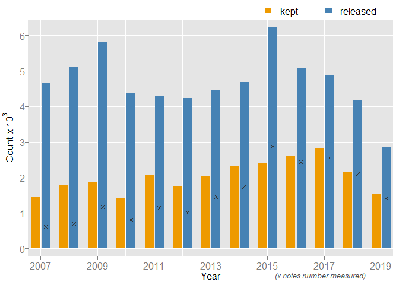
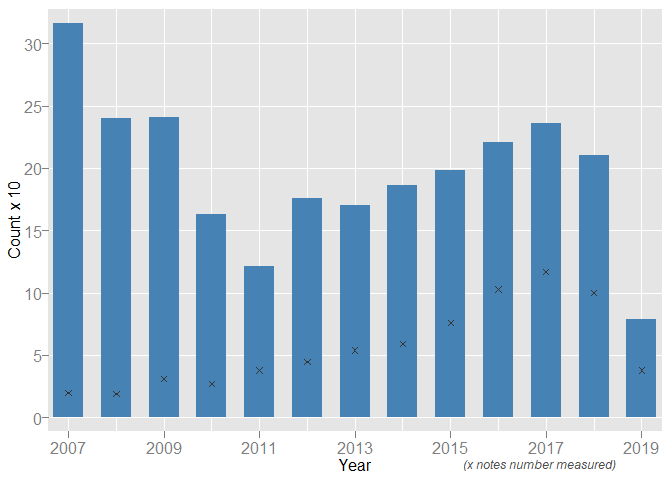
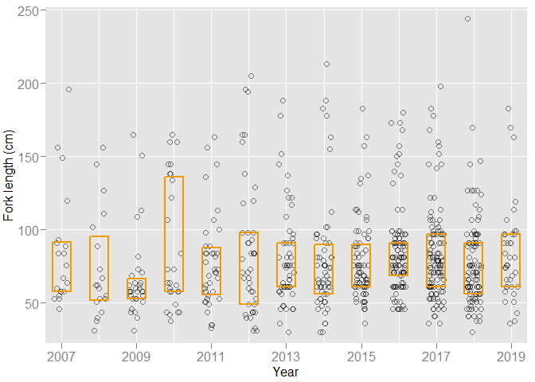
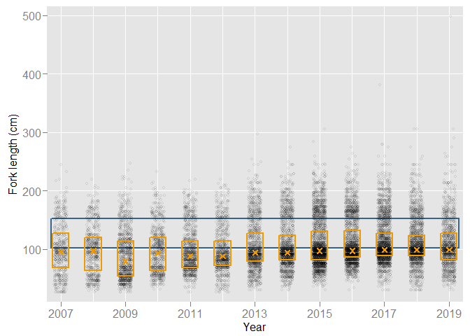
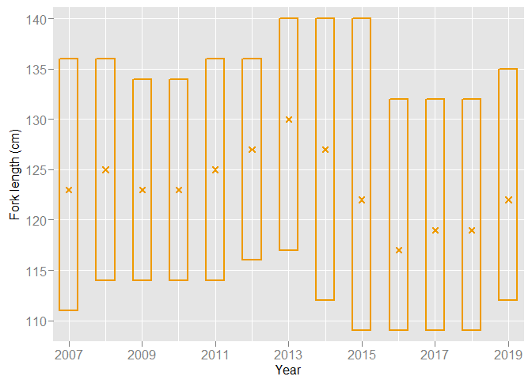
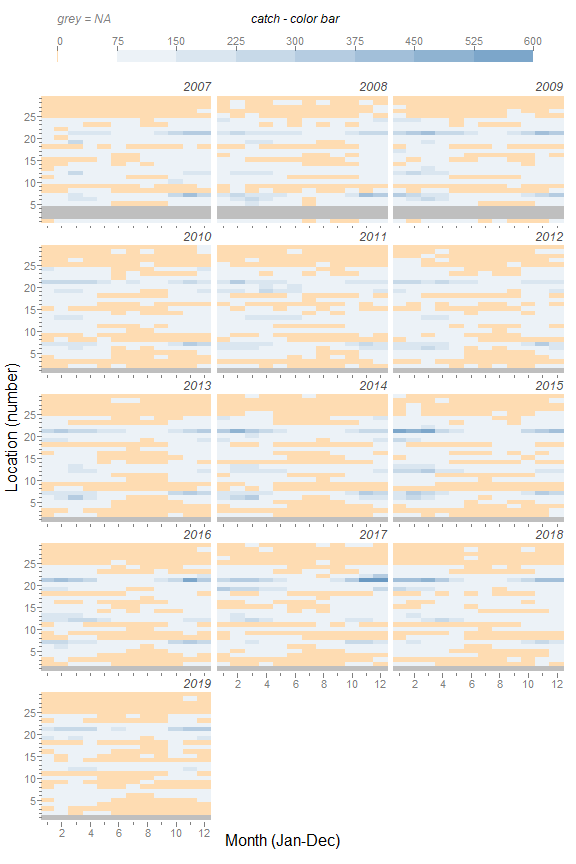

-----

-----

<!-- chunks for data loading, data clean up, & global variables -->

<!-- include child files -->

<!-- See annual summary data saved as `card_summary.csv` within this directory (`fishery`).  -->

<!-- TODO: MORE NARRATIVE HERE for table summary
(1) explain with comments each code chunk
(2) narrative: wording about pre-ALDS & ALDS, free & then charge
(3) narrative: note about pre-ALDS not having DNF category
(4) narrative: number table and then reference number; explain field names
(5) decide whether or not to include species fate
(6) decide whether or not to save output to .csv file
-->

<!-- Cards issued (purchased) -->

<!-- Cards returned -->

<!-- below adds more fields to annual summary -->

<!-- may not include below in display -->

<!-- numbers -->

<!-- length -->

<!-- length frequency -->

<!-- per angler -->

<!-- per month -->

<!-- per month & location -->

<!-- per location by species -->

<!-- top 5 WST catch location -->

<!-- rewark disk field summaries -->

<!-- annual summary using `catch_angler` -->

<!-- To get a sense of spatial and temporal catch, we added a 'Season' field to angler catch data. We group seasons as follows: winter = Dec, Jan, Feb; spring = Mar, Apr, May; summer = Jun, Jul, Aug; and fall = Sep, Oct, Nov. To maintain chronology and because winter crosses each calendar year, we 'pushed' Dec into the next Card year. For example, Dec 2008 is grouped with Jan 2009 & Feb 2009 to make winter 2009. As such, winter 2007 (Dec 2006, Jan 2007, & Feb 2007) is data "light" because the Card did not really come on-line until March 2007. Consider this fact when viewing annual summaries for winter 2007. -->

<!-- Here we display but 5 rows of the `nrow(catch_yr_loc)` annual summary of seasonal and geographic (location) catch. For `Species`, 'k' denotes kept and 'r' denotes released. Seasons are abbreviated 'uk', 'wi', 'sp', 'su', and 'fa' (unknown, winter, spring, summer, fall). `Total` is total annual catch per location, and `NumAngl` and `NumMeas` are number of anglers and number (of fish) measured. We use (converted) fork length (in centimeters) and provide mean and standard deviation (sd) when number measured greater than 0. -->

<!-- catch per season, creates new dataframe from `catch` -->

<!-- caption automation here -->

<!-- begin narrative below -->

## Introduction

Herein provides a summary of California Sturgeon Report Card (Card)
data. Since 2007, the Card has been required of any angler fishing for
sturgeon. It is part of a suite of sport fishing regulations intended to
protect California’s year-round White Sturgeon fishery while increasing
protections for the federally-threatened Green Sturgeon population and
adding resiliency to the conservation-dependent White Sturgeon
population. Card data are complementary to on-going research and
monitoring conducted by the California Department of Fish and Wildlife
(CDFW) and other entities.

The Card includes fields for angler contact information (pre-printed),
retained White Sturgeon, and released sturgeon. To aid CDFW’s efforts to
reduce illegal commercialization of sturgeon and to enforce the daily
and annual bag limits on White Sturgeon, each Card also includes
detachable single-use serially numbered Card-specific tags to be placed
on retained White Sturgeon. Anglers must record the day, month, and
location for any sturgeon they catch and keep or catch and release.
Anglers also must record sturgeon length if kept. Though not required,
many anglers record length for sturgeon released. A ‘Reward Disk’ field
is available should the angler catch a sturgeon with a CDFW-affixed disc
tag.

**NOTES**

1)  Card data are not static, and summaries may change as new data
    become available. The current summary year (typically one year
    behind current calendar year) is most affected by this. This summary
    report is updated periodically as new data are collected. The most
    recent data extraction was 03-Jun-2020 @ 11:54.

2)  Reporting for current valid Card (year 2020) is not due until
    31-Jan-2021. Consider this when viewing any summary herein for 2020.

3)  From 2007-2017, CDFW produced single-year Card summary reports.
    These reports are available at
    <https://wildlife.ca.gov/Conservation/Delta/Sturgeon-Study/Bibliography>,
    find title *‘YYYY’ Sturgeon Fishing Report Card: Preliminary Data
    Report*, though updated annual summaries are found herein. The
    CDFW’s Sportfish Unit will no longer produce single-year
    summaries.

4)  The Card was first made available 01-Mar-2007. Some anglers reported
    data for Jan 2007 & Feb 2007; however, catch data are a bit ‘thin’
    for this period compared to the norm. Keep this in mind when
    interpreting summaries herein.

5)  Card location descriptions as written are long. For conciseness,
    locations *codes* are displayed in figures and tables herein. For
    reference, please see table in section ‘Card Location Codes and
    Descriptions.’

6)  ‘disk’ or ‘disc’ are used interchangeably when referring to the
    external tag CDFW affixes to White Sturgeon. The Card uses ‘disk’.

*CDFW contact*: [Jason DuBois](mailto:jason.dubois@wildlife.ca.gov)

## Distribution and Return

The Card has been distributed through the Automated License Data System
(ALDS) since 2012. From 2007 through 2012, the Card was issued free of
charge. A fee of \~$8 was set in 2013. Initially, Cards were categorized
as catch or no catch, but in 2010 a ‘did not fish’ check box was
included (Table 1).

The ALDS affords anglers on-line reporting. There has been a steady
increase of anglers making use of such accommodation (Table 1, see ‘IS’
or Internet submission). Further, there has been an increase overall in
reporting (‘ReportingRate’), though it seems to have reached a plateau
(Table 1; \~33%).

Table 1 field names explained below for reference.

  - left-most column: calendar year for which Card was issued (sold)
  - **Issued**: number of Cards issued (or sold post 2012)
  - **NoEffort**: number of anglers reporting ‘did not fish’ (available
    from 2010)
  - **NoCatch**: number of anglers reporting ‘fished, no catch’
  - **Catch**: number of anglers reporting catching one or more sturgeon
  - **ReturnRate**: sum of NoEffort, NoCatch, Catch divided by Issued
  - **NotReturned**: number of Cards not returned
  - **CC**: Control Center - Card entered by CDFW staff
  - **IS**: Internet Submission - Card entered (reported) on-line by
    angler

*Table 1. 2007-2020 Card distribution, return, and return rate. Did not
fish (‘NoEffort’) not an option 2007-2009. Automated License Data System
implemented 2012, making possible Internet submission (IS).*

|      |  Issued | NoEffort | NoCatch | Catch | ReturnRate | NotReturned |     CC |     IS |
| ---- | ------: | -------: | ------: | ----: | ---------: | ----------: | -----: | -----: |
| 2007 |  37,680 |       NA |   5,064 | 1,855 |      18.36 |      30,761 |     NA |     NA |
| 2008 |  53,777 |       NA |   5,281 | 2,048 |      13.63 |      46,448 |     NA |     NA |
| 2009 |  72,499 |       NA |   6,350 | 2,208 |      11.80 |      63,941 |     NA |     NA |
| 2010 |  66,357 |    1,482 |   4,275 | 1,758 |      11.33 |      58,842 |     NA |     NA |
| 2011 | 112,000 |    4,374 |   5,765 | 2,274 |      11.08 |      99,587 |     NA |     NA |
| 2012 | 112,800 |    5,382 |   5,203 | 2,052 |      11.20 |     100,163 | 10,797 |  1,844 |
| 2013 |  50,915 |    3,130 |   5,213 | 2,290 |      20.90 |      40,273 |  6,850 |  3,792 |
| 2014 |  49,260 |    3,258 |   6,173 | 2,645 |      24.51 |      37,184 |  5,984 |  6,094 |
| 2015 |  48,337 |    4,423 |   7,052 | 2,870 |      29.75 |      33,955 |  5,525 |  8,858 |
| 2016 |  47,617 |    6,129 |   6,682 | 2,997 |      32.92 |      31,943 |  4,494 | 11,181 |
| 2017 |  44,374 |    4,715 |   7,236 | 2,814 |      33.52 |      29,502 |  3,658 | 11,223 |
| 2018 |  44,146 |    4,858 |   6,968 | 2,398 |      32.55 |      29,778 |  2,870 | 11,498 |
| 2019 |  40,844 |    4,574 |   6,126 | 1,742 |      30.84 |      28,248 |  2,133 | 10,463 |
| 2020 |  35,986 |        0 |       1 |    NA |       0.00 |      35,985 |      1 |     NA |

## Reported Catch

Anglers must report sturgeon catch, whether kept or released. Anglers
may keep only White Sturgeon, with bag limits of one daily and three
annually. On average, each year anglers keep about 2,000 White Sturgeon
(Figure 1). Anglers catch and release an annual average of about 4,600
White Sturgeon (Figure 1).

*Figure 1. 2007-2019 Annual White Sturgeon catch (kept & released) from
reported Cards. ‘x’ denotes number measured (released) and orange bars
represent number kept (nearly all of which are measured as required by
regulations).*

Green Sturgeon are bycatch in the White Sturgeon fishery. Anglers may
not keep a Green Sturgeon and annually release on average about 190
(Figure 2).

*Figure 2. 2007-2019 Annual Green Sturgeon bycatch from reported Cards.
‘x’ denotes number measured.*

The Card provides species check boxes (White or Green) for fish released
with no reward disk present. No such check boxes exist for fish released
with reward disk present, given a correctly recorded disk tag number
provides trace back to CDFW release data. Annually, on average, about 40
sturgeon cannot be identified to species given the available
information.

## Catch per Angler

Roughly ⅔ to ¾ of anglers who report catching sturgeon catch only 1 or 2
White Sturgeon per year (includes both kept and released; Table 2). Few
anglers (\<4%) catch 15 or more, and each year at least one angler
reports catching many White Sturgeon (Table 2, field ‘Max’).

*Table 2. 2007-2019 Annual White Sturgeon catch (kept or released) by
angler. Displayed number is fraction of total anglers who report
catching one or more sturgeon. Does not include anglers who reported
‘fished no catch’ or ‘did not fish.’ Column headings denote binned
sturgeon catch, with ‘Max’ showing highest annual catch for one angler.*

|      |  1-2 |  3-4 |  5-6 |  7-8 | 9-10 | 11-12 | 13-14 |  15+ | Max |
| :--- | ---: | ---: | ---: | ---: | ---: | ----: | ----: | ---: | --: |
| 2007 | 0.67 | 0.15 | 0.06 | 0.03 | 0.02 |  0.01 |  0.01 | 0.04 |  39 |
| 2008 | 0.66 | 0.17 | 0.06 | 0.03 | 0.02 |  0.01 |  0.01 | 0.04 |  39 |
| 2009 | 0.67 | 0.14 | 0.07 | 0.03 | 0.02 |  0.01 |  0.01 | 0.04 | 143 |
| 2010 | 0.66 | 0.16 | 0.07 | 0.03 | 0.03 |  0.01 |  0.01 | 0.04 |  53 |
| 2011 | 0.68 | 0.17 | 0.05 | 0.03 | 0.02 |  0.01 |  0.01 | 0.02 |  82 |
| 2012 | 0.69 | 0.15 | 0.06 | 0.03 | 0.02 |  0.01 |  0.00 | 0.03 |  32 |
| 2013 | 0.71 | 0.15 | 0.06 | 0.03 | 0.01 |  0.01 |  0.01 | 0.02 |  84 |
| 2014 | 0.72 | 0.15 | 0.05 | 0.02 | 0.02 |  0.01 |  0.01 | 0.02 |  49 |
| 2015 | 0.69 | 0.15 | 0.06 | 0.03 | 0.02 |  0.01 |  0.01 | 0.03 |  44 |
| 2016 | 0.73 | 0.14 | 0.05 | 0.03 | 0.01 |  0.01 |  0.01 | 0.02 |  39 |
| 2017 | 0.71 | 0.15 | 0.05 | 0.03 | 0.01 |  0.01 |  0.01 | 0.02 |  40 |
| 2018 | 0.73 | 0.15 | 0.04 | 0.02 | 0.02 |  0.01 |  0.01 | 0.02 |  41 |
| 2019 | 0.75 | 0.13 | 0.04 | 0.02 | 0.02 |  0.01 |  0.01 | 0.02 |  33 |

#### 2013-present

In the ALDS-era and post-2012, Card reporting has consistently offered
three categories: did not fish; fished no catch; and fished (& caught).
This facilitates analyzing catch for the angling population expending
effort (i.e., to not include ‘did not fish’ anglers).

Annually, on average about 1.4% (0.014) of anglers (n ≥ 1000 reporting)
who fish catch and release at least one Green Sturgeon (Table 3). Some
anglers do catch and release more than one Green Sturgeon annually
(Table 3, see ‘Max’ field).

*Table 3. 2013-2020 Annual fraction of all reporting anglers who caught
and then released one or more Green Sturgeon. ‘Max’ denotes maximum
annual catch for one angler.*

|      | Anglers | Fraction | Max |
| :--- | ------: | -------: | --: |
| 2013 |     120 |   0.0160 |   7 |
| 2014 |     137 |   0.0155 |   7 |
| 2015 |     151 |   0.0152 |   5 |
| 2016 |     157 |   0.0164 |   5 |
| 2017 |     154 |   0.0152 |   8 |
| 2018 |     141 |   0.0148 |  15 |
| 2019 |      60 |   0.0075 |   3 |
| 2020 |       0 |   0.0000 |   0 |

Of reporting anglers (n ≥ 1000, including ‘did not fish’), about 9%
(0.09) on average keep one White Sturgeon. Fewer still keep the limit of
three (Table 4). Roughly 27%-39% anglers reported ‘did not fish.’

*Table 4. 2013-2020 Annual fraction of all reporting anglers who kept 0
(none), 1, 2, or 3 White Sturgeon per Card (calendar) year. ‘NoEffort’
denotes anglers reporting ‘did not fish.’*

|      | Anglers |   None | Kept-1 | Kept-2 | Kept-3 | NoEffort |
| :--- | ------: | -----: | -----: | -----: | -----: | -------: |
| 2013 |  10,642 | 0.5631 | 0.1031 | 0.0307 | 0.0089 |   0.2941 |
| 2014 |  12,074 | 0.5826 | 0.1091 | 0.0320 | 0.0065 |   0.2698 |
| 2015 |  14,382 | 0.5633 | 0.0968 | 0.0264 | 0.0060 |   0.3075 |
| 2016 |  15,674 | 0.4872 | 0.0868 | 0.0263 | 0.0086 |   0.3910 |
| 2017 |  14,872 | 0.5439 | 0.0992 | 0.0299 | 0.0100 |   0.3170 |
| 2018 |  14,368 | 0.5470 | 0.0864 | 0.0217 | 0.0067 |   0.3381 |
| 2019 |  12,596 | 0.5407 | 0.0744 | 0.0176 | 0.0041 |   0.3631 |
| 2020 |       1 | 1.0000 | 0.0000 | 0.0000 | 0.0000 |   0.0000 |

To derive the number of anglers who actively practice catch-n-release
only is not possible given available data. However, of the reporting
anglers who fished, between 6.6% and 10.1% released sturgeon yet
retained none (2013-2019, years with ≥ 1000 reporting).

## Length

Anglers must report length for White Sturgeon kept. Anglers are not
required to report length of released fish, but some do, typically in
the species check box. Anglers report inches, as required by
regulations, and herein lengths were converted to centimeters fork
length (FL).

Occasionally, an angler will report a suspiciously small length (i.e., ≤
10). Likely, here the angler is using short hand for catch (i.e., number
caught). So, any “length” ≤ 10 is flagged and set to `NA` for analytical
purposes (Table 5).

*Table 5. 2007-2019 Annual count of reported ‘lengths’ by species CDFW
identified as suspect (i.e., too small). For White Sturgeon, this
includes kept and released fish, but most are released.*

|      | White | Green |
| :--- | ----: | ----: |
| 2007 |     2 |     0 |
| 2008 |     0 |     0 |
| 2009 |     5 |     0 |
| 2010 |     1 |     0 |
| 2011 |     1 |     0 |
| 2012 |     1 |     0 |
| 2013 |     2 |     1 |
| 2014 |     6 |     1 |
| 2015 |     3 |     1 |
| 2016 |    15 |     1 |
| 2017 |    13 |     0 |
| 2018 |     5 |     0 |
| 2019 |    11 |     0 |

#### Green Sturgeon

Of the reported valid lengths, most Green Sturgeon are less than 100 cm
(\~40 inches; Figure 3). The orange box represents the interquartile
range (25%-75%).

*Figure 3. 2007-2019 Reported Green Sturgeon lengths (converted from
inches to centimeters). Bottom and top of orange box denotes 25th and
75th percentile. Note: noise added to x-axis to lessen over-plotting.*

#### White Sturgeon (released)

Length distributions indicate annual median values below 102 cm FL, the
lower bound for the slot (Figure 4, see ‘x’ on figure). From 2013-2019,
it appears anglers were catching more sub-slot sized fish, measuring
more sub-slot sized fish, or a combination of both (Figure 4, see
progressively darker points below the slot). Anglers released White
Sturgeon that could have been retained.

*Figure 4. 2007-2019 Reported released White Sturgeon lengths (converted
from inches to centimeters). Bottom and top of orange box denotes 25th
and 75th percentile, ‘x’ denotes median. Blue box denotes current slot
limit 102-152 cm FL (40-60 inches FL). Note: noise added to x-axis to
lessen over-plotting.*

#### White Sturgeon (kept)

Length quartiles 25%, 50%, and 75% show in certain years anglers
harvested more fish closer in length to the upper slot limit and other
years more fish closer in length to the low slot limit (Figure 5). This
might indicate a year class (or classes) growing into and out of the
slot limit (102-152 cm FL or 40-60 in FL).

*Figure 5. 2007-2019 Reported kept White Sturgeon lengths (converted
from inches to centimeters). Bottom and top of orange box denotes 25th
and 75th percentile. ‘x’ denotes median.*

## Catch by Location & Month

Card data make possible some spatial and temporal analyses. Though
spatially the data are coarse, limited to larger geographic sections and
not specific way-points. This section explores such analytics for all
White Sturgeon (kept & released).

#### Location: Ranking Top 5 for White Sturgeon

Suisun Bay (code 18) consistently yields the greatest fraction of White
Sturgeon catch, 2008 excepted (Table 6; 20%-40%). In fact, Suisun Bay is
typically 5+ points higher than the second-ranked location. Sacramento
River: Rio Vista to Chipps Island (code 04) is also a top spot for White
Sturgeon catch (Table 6).

*Table 6. 2007-2019 Annual top 5 ranking of locations with highest White
Sturgeon catch. Number is location code (in parentheses denotes percent
of total).*

|      | First   | Second  | Third   | Fourth  | Fifth  |
| :--- | :------ | :------ | :------ | :------ | :----- |
| 2007 | 18 (23) | 04 (17) | 09 (12) | 16 (7)  | 03 (7) |
| 2008 | 04 (21) | 18 (20) | 09 (10) | 03 (9)  | 16 (6) |
| 2009 | 18 (28) | 04 (18) | 09 (9)  | 03 (7)  | 14 (6) |
| 2010 | 18 (25) | 04 (20) | 10 (7)  | 16 (6)  | 17 (6) |
| 2011 | 18 (22) | 04 (15) | 16 (14) | 10 (10) | 03 (9) |
| 2012 | 18 (25) | 04 (16) | 03 (10) | 10 (7)  | 09 (7) |
| 2013 | 18 (26) | 04 (17) | 03 (11) | 09 (10) | 16 (7) |
| 2014 | 18 (28) | 04 (15) | 03 (11) | 09 (10) | 10 (7) |
| 2015 | 18 (30) | 04 (16) | 09 (12) | 03 (8)  | 16 (6) |
| 2016 | 18 (29) | 04 (17) | 09 (13) | 10 (7)  | 03 (6) |
| 2017 | 18 (34) | 16 (16) | 09 (11) | 04 (11) | 19 (8) |
| 2018 | 18 (40) | 09 (11) | 04 (10) | 16 (8)  | 19 (7) |
| 2019 | 18 (37) | 09 (12) | 16 (11) | 10 (8)  | 04 (7) |

#### Month: White Sturgeon

Though the White Sturgeon fishery is open year-round, there appears to
be a natural seasonality (Table 7). Catch as a fraction of total caught
is lowest late spring through summer (Table 7). Unlike location, no
single month stands out as exceptional; winter and spring months hover
around 15%.

*Table 7. 2007-2019 Annual White Sturgeon catch by month. Number
represents percent of total annual catch. Note: Card not required until
01-Mar-2007, so 2007 Jan & Feb data not representative of full fishing
effort.*

|      |  Jan |  Feb |  Mar |  Apr | May | Jun | Jul | Aug | Sep |  Oct |  Nov |  Dec |
| :--- | ---: | ---: | ---: | ---: | --: | --: | --: | --: | --: | ---: | ---: | ---: |
| 2007 |  1.4 |  2.2 | 18.4 | 11.8 | 7.1 | 3.2 | 2.3 | 2.1 | 4.5 | 12.1 | 17.6 | 17.4 |
| 2008 |  9.6 | 14.6 | 15.9 | 11.0 | 7.1 | 3.8 | 1.6 | 1.7 | 2.1 |  6.4 | 13.0 | 13.2 |
| 2009 | 13.1 | 15.4 | 16.5 | 11.3 | 5.9 | 3.1 | 2.3 | 2.0 | 2.8 |  6.8 | 10.3 | 10.6 |
| 2010 | 13.6 | 14.9 | 16.0 | 10.6 | 5.5 | 2.6 | 2.6 | 1.9 | 2.7 |  6.7 | 11.0 | 11.8 |
| 2011 | 12.1 | 13.1 | 11.9 | 12.6 | 8.3 | 7.5 | 3.6 | 1.8 | 2.9 |  5.6 | 10.3 | 10.2 |
| 2012 | 12.2 | 13.1 | 12.4 | 14.4 | 6.6 | 4.4 | 2.0 | 1.4 | 2.4 |  7.3 | 11.9 | 11.9 |
| 2013 | 10.1 | 15.0 | 17.8 | 11.3 | 4.7 | 3.3 | 1.6 | 1.3 | 1.8 |  7.4 | 12.6 | 13.2 |
| 2014 | 12.0 | 17.4 | 18.1 | 10.9 | 5.0 | 2.4 | 1.7 | 0.9 | 1.5 |  5.0 | 10.4 | 14.8 |
| 2015 | 17.8 | 18.8 | 19.1 |  7.4 | 3.9 | 2.1 | 0.8 | 1.4 | 1.4 |  5.1 |  9.5 | 12.6 |
| 2016 | 12.7 | 18.4 | 12.4 | 10.3 | 3.5 | 1.4 | 1.0 | 0.8 | 3.2 |  8.3 | 16.1 | 12.0 |
| 2017 |  9.6 | 11.8 | 13.4 |  9.0 | 4.7 | 2.2 | 1.4 | 1.2 | 2.3 | 10.6 | 16.4 | 17.5 |
| 2018 | 13.0 | 14.6 | 15.2 |  9.9 | 4.8 | 2.4 | 1.9 | 1.4 | 3.3 |  7.7 | 13.5 | 12.2 |
| 2019 | 11.8 | 11.4 | 16.1 | 12.2 | 4.2 | 3.9 | 2.1 | 1.4 | 2.3 |  6.9 | 14.4 | 13.5 |

Anglers have reported catching one or more White Sturgeon each month
every year for the following locations: 04(7); 09(12); 18(21) (Figure 6;
y-axis is number in parentheses - see section *Card Location Code* for
y-axis number & corresponding Card code). To date, the highest White
Sturgeon catch was observed Nov 2017 at location 18(21), n=559.

*Figure 6. 2007-2019 Heatmap (or tile plot) showing reported White
Sturgeon catch by location and by month. Grey shading denotes location
not an option on Card, and orange shading denotes zero reported catch.*

## Angler Tag Returns

In 2010, CDFW added a field for reporting the disc tag number, if
present. Some anglers recorded such information starting in 2009 despite
such field’s absence (Table 8). Ideally, an angler should report the
entire alpha-numeric (e.g., HH1234). The prefix denotes the reward value
(e.g., ‘HH’ = $100). A complete tag number makes easier the task of
precisely retrieving CDFW release data. Many anglers do their best, but
not every reported disc tag is complete (Table 8). CDFW staff use
angler-reported disc tags to augment mark-recapture data, perhaps
improving population metrics accuracy. Table field names are explained
below for reference.

  - **Anglers**: number of anglers reporting a disc tag or possible disc
    tag
  - **Good Tag**: count of complete disc tags (angler correctly reported
    disc tag)
  - **No Prefix**: count of disc tags reported without alpha (i.e.,
    missing prefix); likely a valid disc tag but more sleuthing is
    required
  - **Prefix ‘ST’**: count of disc tags reported as 5-digits, no prefix.
    CDFW released $20 disc tags with ‘ST’ followed by 5 digits. So these
    are likely $20 tags but more sleuthing is required.
  - **Reward Only**: count of likely disc tags but no number available.
    Angler reported reward value only (e.g., $50.00).
  - **Zip Only**: count of likely disc tags but no number available.
    Angler reported Stockton zip code (CDFW Stockton address printed
    opposite side of disc tag number).

To date, anglers have reported 29 disc tags as digits only. However,
digits are too few or too many to make a positive match with CDFW
release data.

*Table 8. 2007-2019 Annual count of anglers who reported catching a
disc-tagged sturgeon and number of tags based on completeness of
reported disc number.*

|      | Anglers | Good Tag | No Prefix | Prefix ‘ST’ | Reward Only | Zip Code |
| :--- | ------: | -------: | --------: | ----------: | ----------: | -------: |
| 2009 |       5 |        3 |         0 |           1 |           0 |        0 |
| 2010 |      34 |       23 |        11 |           2 |           0 |        0 |
| 2011 |      37 |       27 |         9 |           3 |           0 |        0 |
| 2012 |      34 |       23 |         3 |           5 |           0 |        0 |
| 2013 |      30 |       24 |         4 |           3 |           0 |        1 |
| 2014 |      40 |       26 |         8 |           1 |           1 |        2 |
| 2015 |      36 |       21 |         7 |           0 |           2 |        1 |
| 2016 |      22 |       18 |         1 |           0 |           0 |        0 |
| 2017 |      28 |       23 |         1 |           1 |           1 |        0 |
| 2018 |      29 |       21 |         0 |           2 |           0 |        1 |
| 2019 |      10 |        9 |         0 |           0 |           0 |        0 |

<!-- save files as desired -->

## Card Location Codes & Descriptions

Card locations are included below for reference. Field ‘Number’ is not
on printed Card and is merely included here for simplifying y-axis in
Figure 6. Card codes 2-9 may appear on Card with leading 0 (e.g., 03).

| Number | Card Code | Card Description                                  |
| :----: | :-------: | :------------------------------------------------ |
|   1    |     1     | Sacramento River: Red Bluff to Colusa (2007-2009) |
|   2    |    01A    | Sacramento River: Upstream of Red Bluff           |
|   3    |    01B    | Sacramento River: Red Bluff to Hwy 32 bridge      |
|   4    |    01C    | Sacramento River: Hwy 32 bridge to Colusa         |
|   5    |     2     | Sacramento River: Colusa to Knights Landing       |
|   6    |     3     | Sacramento River: Knights Landing to Rio Vista    |
|   7    |     4     | Sacramento River: Rio Vista to Chipps Island      |
|   8    |     5     | Feather River                                     |
|   9    |     6     | American River                                    |
|   10   |     7     | Sacramento Deepwater Ship Channel                 |
|   11   |     8     | Yolo Bypass                                       |
|   12   |     9     | Montezuma Slough                                  |
|   13   |    10     | Napa River                                        |
|   14   |    11     | Petaluma River                                    |
|   15   |    12     | San Joaquin River: Upstream of HWY 140 bridge     |
|   16   |    13     | San Joaquin River: HWY 140 bridge to Stockton     |
|   17   |    14     | San Joaquin River: Stockton to Sherman Lake       |
|   18   |    15     | Old River                                         |
|   19   |    16     | San Pablo Bay                                     |
|   20   |    17     | Carquinez Strait                                  |
|   21   |    18     | Suisun Bay                                        |
|   22   |    19     | Grizzly Bay                                       |
|   23   |    20     | San Francisco Bay: North of HWY 80                |
|   24   |    21     | San Francisco Bay: South of HWY 80                |
|   25   |    22     | Pacific Ocean: North of Golden Gate Bridge        |
|   26   |    23     | Pacific Ocean: Golden Gate Bridge to Point Sur    |
|   27   |    24     | Pacific Ocean: Point Sur to San Diego             |
|   28   |    25     | Any reservoir or lake                             |
|   29   |    26     | Klamath River                                     |

-----

CDFW, Sportfish Unit  
**updated**: 15-Jun-2020 @ 11:11
