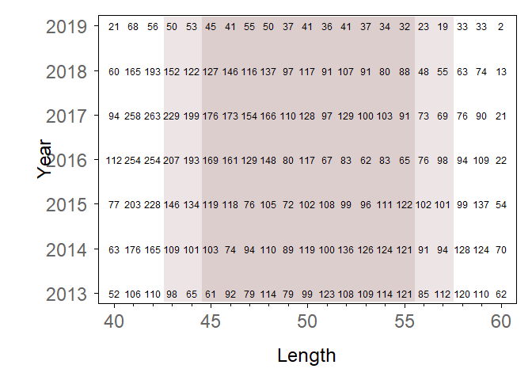
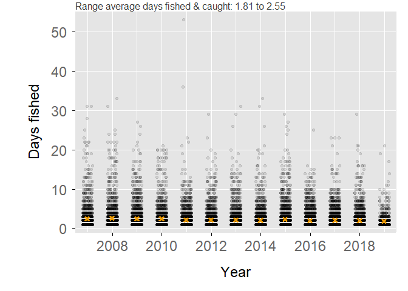
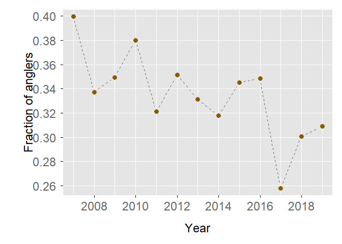

-----

-----

## Introduction

Herein we provide additional sturgeon report card summaries. (See
`annual_card.*` for historical summaries.) We summarize annually the
number of anglers keeping 1, 2, or 3 White Sturgeon. For exploratory
purposes, we observe annual White Sturgeon harvest given two scenarios
restricting (i.e., making smaller) the current slot limit. Finally, to
the extent possible we make some characterizations of the sturgeon
angling population.

**NOTE**: Card data are not static, and summaries may change as new data
become available. The current summary year (typically one year behind
current calendar year) is most affected by this. Most recent data
extraction: 2020-01-22 12:18:06.

**NOTE**: Herein, for readability we display a very limited amount of
computer code. For such code, please see the `.Rmd` file with the same
name.

## Libraries

We load the `sportfish` package, currently available on GitHub. For now
(26-Jun-2019), this is the only package required.

``` r
library(sportfish)
# library(package)
```

## Load Data

We load all `.rds` files from directory `data/card`. To keep our
workspace clean, we load these files into a new environment called
`Card`.

``` r
# the data directory for bay study
data_dir <- "data/card"

# list.files(path = data_dir, pattern = ".rds")

Card <- new.env()
ReadRDSFiles(fileDir = data_dir, envir = Card)
```

    ## RDS Files loaded from:
    ##  data/card
    ##  **********
    ##  AldsPurchased.rds
    ##  AldsReturned.rds
    ##  AnglerCatch.rds
    ##  ArchTally.rds
    ##  ReturnCode.rds
    ##  **********

``` r
# clean up
rm(data_dir)
```

Here we create some variables we’ll use throughout this process. We
create them here and now for convenience.

*Note*: none needed at this time.

## Summaries

In this section, we provide tables and some graphics for summary
purposes. Please see sections below for specifics about harvest, slot
limit scenarios, or angler behavior.

#### Harvest

Currently, anglers may keep up to three White Sturgeon each year. Below
we display annual counts and fractions of anglers keeping 1, 2, or 3
fish. Roughly 6-7% of anglers who catch and keep White Sturgeon retain
the limit (3). About 75% of that demographic keep only 1 fish annually.

| Year | Kept1 | Kept2 | Kept3 | Fraction1 | Fraction2 | Fraction3 |
| ---: | ----: | ----: | ----: | --------: | --------: | --------: |
| 2007 |   827 |   211 |    61 |      0.75 |      0.19 |      0.06 |
| 2008 |   985 |   264 |    91 |      0.74 |      0.20 |      0.07 |
| 2009 |  1066 |   269 |    89 |      0.75 |      0.19 |      0.06 |
| 2010 |   800 |   221 |    62 |      0.74 |      0.20 |      0.06 |
| 2011 |  1102 |   339 |    94 |      0.72 |      0.22 |      0.06 |
| 2012 |   965 |   265 |    84 |      0.73 |      0.20 |      0.06 |
| 2013 |  1098 |   327 |    95 |      0.72 |      0.22 |      0.06 |
| 2014 |  1319 |   386 |    80 |      0.74 |      0.22 |      0.04 |
| 2015 |  1394 |   380 |    88 |      0.75 |      0.20 |      0.05 |
| 2016 |  1364 |   413 |   135 |      0.71 |      0.22 |      0.07 |
| 2017 |  1475 |   444 |   149 |      0.71 |      0.21 |      0.07 |
| 2018 |  1239 |   312 |    96 |      0.75 |      0.19 |      0.06 |
| 2019 |   518 |   107 |    25 |      0.80 |      0.16 |      0.04 |

#### Slot Limit (harvest at length)

Current regulations allow anglers to keep annually up to 3 White
Sturgeon between 40 and 60 inches fork length (FL). Here we explore the
“savings” (in counts of White Sturgeon) given two scenarios
restricting (i.e., making smaller) our current slot size: (1) 43-57
inches FL and (2) 45-55 inches FL. *Please note*: these scenarios are
merely for demonstration purposes and do not reflect actual regulation
change proposals.

Below we display a somewhat unorthodox annual length frequency
distribution. We show year (y-axis) by fork length (x-axis). The numbers
in the plot represent White Sturgeon count by length in 1-inch
increments. For this purpose, we restrict our analysis to include only
kept fish and only years 2013 \[1\] onward. We shade in light red the
two scenarios mentioned above.

<!-- -->

Below we show number of fish **not** harvested given our two scenarios.
`_l` denotes sub-legal and `_u` represents over-legal under the
restricted slot sizes. Overall (i.e., for the six-year period) numbers
are shown below the table. For example, over the 6-year period, if the
upper limit would have been set at 55-inches FL, almost 2500 White
Sturgeon would not have been harvested.

| Year | Range43\_57\_l | Range43\_57\_u | Range45\_55\_l | Range45\_55\_u |
| ---: | -------------: | -------------: | -------------: | -------------: |
| 2013 |            268 |            292 |            431 |            489 |
| 2014 |            404 |            322 |            614 |            507 |
| 2015 |            508 |            290 |            788 |            493 |
| 2016 |            620 |            225 |           1020 |            399 |
| 2017 |            615 |            187 |           1043 |            329 |
| 2018 |            418 |            150 |            692 |            253 |
| 2019 |            145 |             68 |            248 |            110 |

|                | Count |
| -------------- | ----: |
| Range43\_57\_l |  2978 |
| Range43\_57\_u |  1534 |
| Range45\_55\_l |  4836 |
| Range45\_55\_u |  2580 |

#### Angler Behavior

Here we plot days fished by each angler who caught (kept or released or
both) a White Sturgeon. Days fished include only days for which the
angler caught White Sturgeon and does not include 0-catch days (i.e.,
for White Sturgeon).

Each point represents an angler, and darker areas indicate more anglers.
Most anglers fish and catch fewer than 6 days per year. In fact, the
average (orange X in plot) is roughly 2 days per year. A select few
anglers catch White Sturgeon \> 20 days per year. (*Note*: noise added
to x-axis to mitigate over-plotting.)

<!-- -->

Anglers may keep up to one White Sturgeon per day, three per year. In a
given day, any angler keeping a White Sturgeon must stop fishing for
that day.

Here we explore anglers who catch-n-release and catch-n-keep White
Sturgeon on the same day. Given anglers may keep up to three White
Sturgeon per year, we further explore how many anglers do this not just
once per year, but twice or three times in a given year.

Overwhelmingly, many anglers do not catch-n-release and catch-n-keep
White Sturgeon in the same day (see range in field `Prop0` below). Only
about 10% of anglers catch-n-release and catch-n-keep White Sturgeon on
1 day, and very few do this 3 days per year. Whole numbers indicate
number of anglers, decimals fractions of total. Range based on annual
numbers from 2007 to 2019.

|     | Day0 | Day1 | Day2 | Day3 |  Prop0 |  Prop1 |  Prop2 |  Prop3 |
| --- | ---: | ---: | ---: | ---: | -----: | -----: | -----: | -----: |
| Min |  842 |   84 |   14 |    1 | 0.8576 | 0.0893 | 0.0130 | 0.0008 |
| Max | 2622 |  300 |   51 |   16 | 0.8948 | 0.1157 | 0.0203 | 0.0079 |

Given the data we collect (or do not collect), it is challenging to
describe accurately the catch-n-release element of the White Sturgeon
fishery. Here we display annually the fraction of anglers deemed
catch-n-release. We do not know for certain if these anglers just simply
did not catch a legal-sized fish — though some anglers do provide
lengths of released fish — or if these anglers were actively
catch-n-release types (i.e., they released all White Sturgeon
irrespective of size). Please keep this in mind when interpreting the
plot below.

<!-- -->

-----

CDFW, SportFish Unit  
2020-01-22

1.  the year in which regulations changed from total length to fork
    length. Not including other years reduces ambiguity due to
    conversion.
