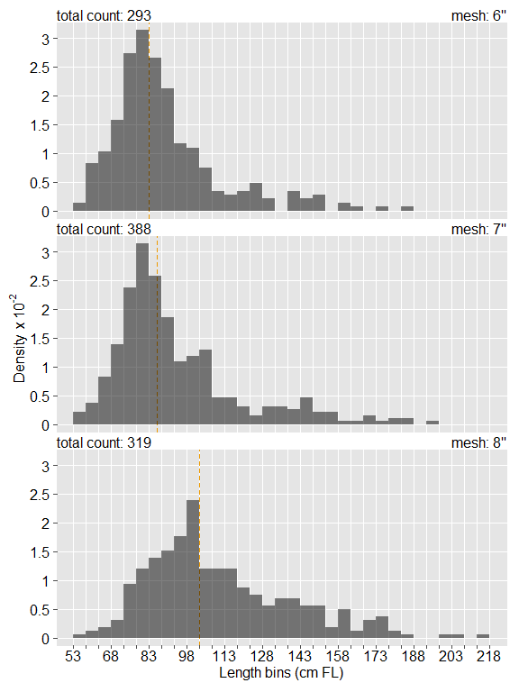
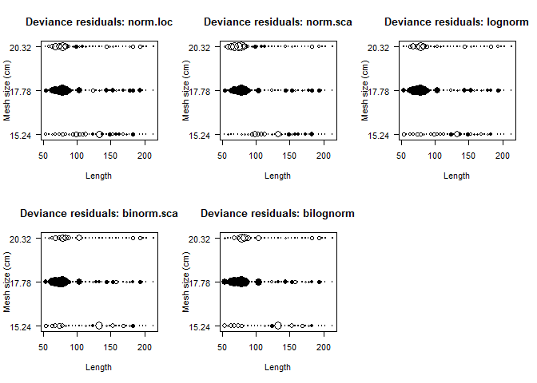
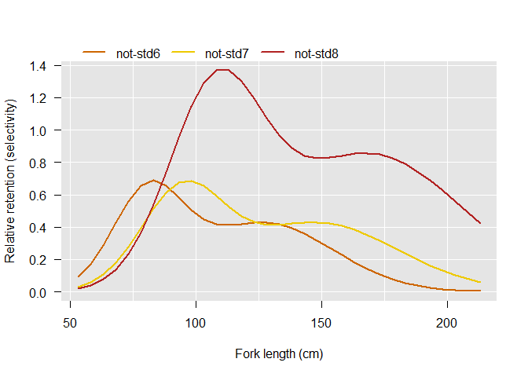
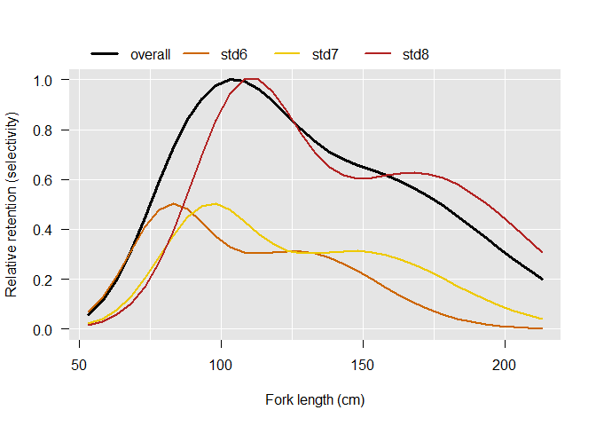
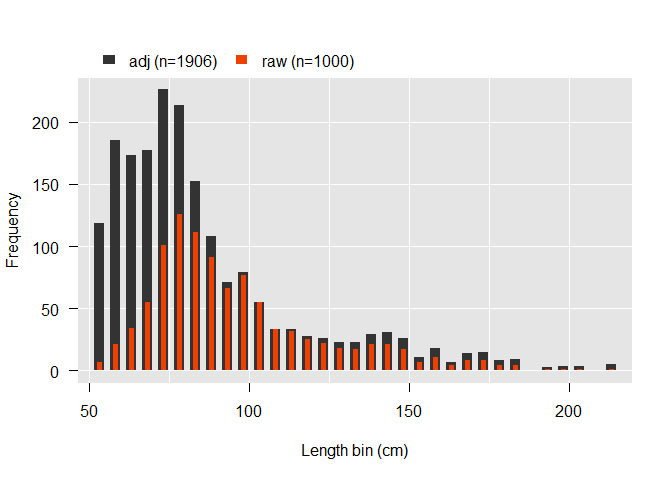
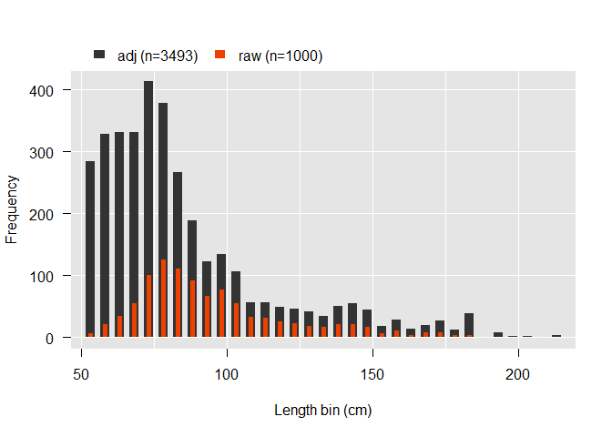
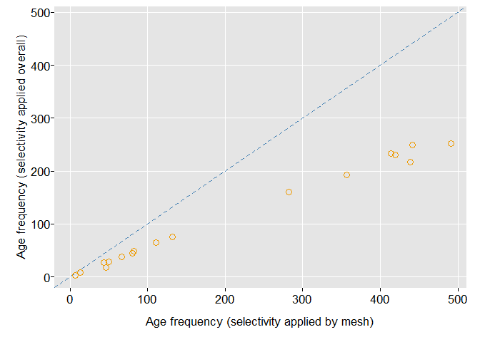

-----

-----

## Introduction

Herein, we demonstrate the application of gear selectivity models on
CDFW sturgeon catch data. The CDFW uses trammel nets to catch sturgeon
of varying lengths. The current trammel net configuration joins 4x150’
panels, where each panel is one of three mesh sizes: 6“; 7”; or 8“.
There are two 8” panels and one each of the 6" & 7".

S. Blackburn — when developing the Sturgeon Population Model — employed
selectivity models developed by R. Millar. Herein, we use Blackburn’s
methods to eventually arrived at an adjusted age frequency distribution.
Such a distribution is a key component in the population model. Thus,
reducing biases caused by gear selectivity could improve the population
model’s accuracy.

## Libraries

We load the `spopmodel` & `sportfish` packages, currently available on
GitHub. For now (2019-10-25), these are the only packages required.
*Note*: masking will occur, as many functions with same names exist in
both packages.

``` r
library(spopmodel)
library(sportfish)
```

## Load Data

We will use data included in `package:spopmodel`. We’ll use the
`trammel_catch` dataset. With `spopmodel` installed and loaded, simply
type `trammel_catch` in your R session.

<!-- ## Variables -->

<!-- Here we create some variables we'll use throughout this process. We create them here and now for convenience. -->

## Dataset Components

    ## 'data.frame':    1000 obs. of  3 variables:
    ##  $ MeshSize: num  7 7 7 8 8 8 8 8 6 7 ...
    ##  $ FL      : num  73 83 86 76 76 77 79 84 85 76 ...
    ##  $ Age     : num  6 7 7 6 7 7 9 8 7 8 ...

`trammel_catch` has 3 variables (fields) and 1000 observations (rows).
Below we show the number of NA values in each variable. For this
demonstration, we will use only fields `MeshSize` (trammel webbing size
of 6-, 7-, or 8-inch mesh) & `FL` (measured fork length in centimeters).

    ## MeshSize       FL      Age 
    ##        0        0      639

## Frequency by Mesh

We need to calculate length frequency distribution by mesh size. To do
this we split fork length (`FL`) data (using `sportfish::Split()`) on
`MeshSize`. We then can apply `sportfish::Frequency()`, supplying
`binWidth` as 5 and `xRange` from 53 to 217 cm. *Note*: after loading
package `sportfish`, use `help("Split")` or `help("Frequency")` for more
details on these functions.

Below we display length frequency distribution by mesh size. The dashed
orange vertical line indicates median value. Bin width is 5 cm. Total
count (n) per mesh is provided on each plot’s upper left. Overall count
is 1000.

<!-- -->

## Apply Millar’s `NetFit()`

Here we apply Russell Millar’s gear selectivity models to our
`trammel_catch` dataset. For more information, run `help("ApplyNetFit")`
in your R session and check out the `References` section.

`spopmodel::ApplyNetFit()` fits five of Millar’s models (run
`help("ApplyNetFit")` & see `Details`). It is essentially a wrapper for
Millar’s `NetFit()` (again, see `help("ApplyNetFit")` for more details).
In short, we choose the model with the lowest deviance. See results
below as we display a deviance plot for each model.

**Note**: In recent years, the CDFW Sturgeon Population Study has
deployed trammel nets in an 8“–6”–7“–8” configuration, where the numbers
denote mesh size of each panel. Panels are 150’ long and — given the
configuration — 8“-mesh panels are fished with twice the effort as the
other two. As such, fishing power (as required by Millar’s models) for
the entire net is `c(1, 1, 2)` (6”, 7“, 8”).

<!-- -->

Below we display the deviance value for each model. We choose the model
with the lowest deviance (in this case binorm.sca).

    ##   norm.loc   norm.sca    lognorm binorm.sca  bilognorm 
    ##   154.0448   207.6966   157.9597   143.2449   143.5929

#### Relative Retention (Selectivity)

Here we apply Millar’s `selncurves()` using
`spopmodel::RelativeRetention()` as a convenient wrapper. At the heart
of `selncurves()` is the code chunk below, where `plot_lens` are the
fork length bins and `mesh_size` is a vector of mesh sizes converted to
cm, if needed. `r` is essentially `selncurves()` appropriate for the
selected model, and `param` holds other model parameters.

`base::outer(X = plot_lens, Y = mesh_size, FUN = r, param)`

The resulting matrix *A* can be standardized (optional) by dividing *A*
by max(*A*). Doing so will then render 1 as the maximum value in *A*.

#### Standardized (Overall or By Mesh Size)

S. Blackburn (when developing the sturgeon population model)
standardized post application of `selncurves()`. Output is that of a
matrix (see first 5 rows below). S. Blackburn summed by row columns 2-4
(i.e., relative retention by each mesh size). Next, row sums were
divided by max(row sums), thus standardizing the values. The results are
displayed — along with standardized values — as the solid black line in
the second of the two relative retention plots below.

    ##   FL          6          7          8
    ## 1 53 0.09177355 0.02880152 0.02121149
    ## 2 58 0.17236540 0.05709594 0.04144762
    ## 3 63 0.28800290 0.10505307 0.07769954
    ## 4 68 0.42682171 0.17806457 0.13824832
    ## 5 73 0.56108613 0.27689792 0.23183639

Below we plot selectivity results (*not standardized*) for model
binorm.sca (deviance \~ 143). The 8" mesh’s peak is double that of the
other two because of fishing power (effort).

<!-- -->

Below we plot selectivity results (*standardized* within function
`selncurves()`) for model binorm.sca (deviance \~ 143). The solid black
line is relative retention per S. Blackburn’s method, which gives an
overall retention rather than a per mesh-size retention.

<!-- -->

## Catch (Adjusted vs. Raw)

Ultimately, the goal is to use relative retention to “adjust” raw catch
(see equation below). This mitigates for size-selective biases between
mesh sizes and thus age frequencies generated from application of an
age-length key on length frequencies. For each length bin, we divide
catch frequency by the relative retention value. However, the two
approaches below can yield vastly different results.

1)  per bin, divide catch by (overall) relative retention for “adjusted”
    length frequency distribution  
2)  per bin & **per mesh size**, divide catch by relative retention then
    sum values by row for “adjusted” length frequency distribution

Here we show results of method 1. Total catch (n) is provided in the
legend. In this example, raw catch is 1000 fish.

<!-- -->

Here we show results of method 2. Total catch (n) is provided in the
legend. Note the comparatively large adjusted n.

<!-- -->

## Age Frequency

We create an age-length key using data in `trammel_catch` and
`spopmodel::MakeALKey()`. We use the same bins we’ve used in our length
frequencies above. We then apply this age-length key to the appropriate
adjusted length frequency (as applied to each mesh or applied overall).
We see from the figure below age frequency using the
applied-to-each-mesh method is roughly double that using the overall
method (dashed blue line is intercept = 0 & slope = 1).

**Note**: I am not entirely sure which application is more appropriate
(overall or by mesh). Correlation is significantly positive but
frequencies are markedly different.

<!-- -->

-----

CDFW, SportFish Unit  
Oct-25-2019, 12:12
