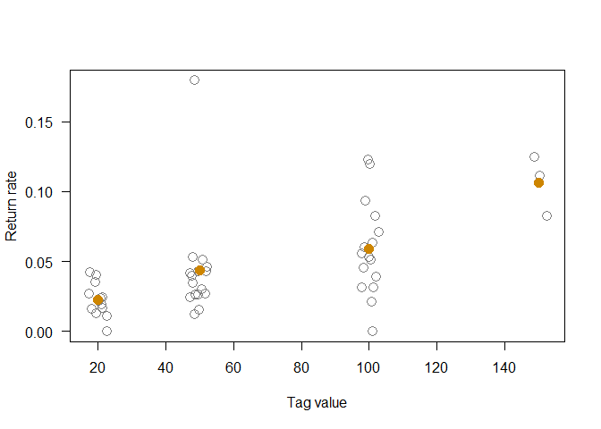

-----

-----

## Introduction

Herein, we explain the complexities of estimating White Sturgeon harvest
rate (exploitation, ), a componet of mortality. We calculate these estimates using
tag releases (by CDFW) and angler tag returns (returns).

## Libraries

We load the `sportfish` package, currently available on GitHub. For now
(27-Feb-2019), this is the only package required.

``` r
library(sportfish)
# library(package)
```

<!--
mortality
- fishing
- natural
- total

use Ricker eqn to get from one metric to another

for exploitation need tags released by reward, tags returned (first year)
-->

## Load Data

We load all `.rds` files from directory `data/tagging`. To keep our
workspace clean, we load these files into a new environment called
`Tagging`.

``` r
# the data directory for bay study
data_dir <- "data/tagging"

# list.files(path = data_dir, pattern = ".rds")

Tagging <- new.env()

ReadRDSFiles(fileDir = data_dir, envir = Tagging)
```

    ## RDS Files loaded from:
    ##  data/tagging
    ##  *************
    ##  Bycatch.rds
    ##  Coordinates.rds
    ##  Effort.rds
    ##  Pinnipeds.rds
    ##  Sturgeon.rds
    ##  TagRecaptures.rds
    ##  TagReturns.rds
    ##  WaterConditions.rds
    ##  WSTHarvest.rds
    ##  *************

``` r
# for consumer price index (adjusting tag $ for inflation) from
# https://www.measuringworth.com/datasets/uscpi/result.php
cpi <- read.csv(file = "~/RProjects/1_DataFiles/USCPI_1998-2018.csv")
cpi$Ratio <- cpi[["USCPI"]][1] / cpi[["USCPI"]]
cpi$Ratio2 <- cpi[["USCPI"]][nrow(cpi)] / cpi[["USCPI"]]

# clean up
rm(data_dir)
```

For analytics herein, we’ll use `WSTHarvest`, which has currently 21478
records. We restrict our analytics to using only data from 1998 onward.
In 1998, the CDFW began issuing three tag reward denominations: $20;
$50; and $100.

## Variables

Here we create some variables we’ll use throughout this process. We
create them here and now for convenience.

*Note*: none needed at this time.

## Method

<Narrative here>

#### Return Rate

We need to get per year per tag value, released count, return count, and
return rate. For this purpose, we’ll use all data (post 1997)
irrespective of size (i.e., fork length) and (or) length category (e.g.,
legal-sized when tagged). Return rate is simply number tags returned
divided by number tags released.

``` r
# for calculating return rate (# returned / # released)
harvest <- aggregate(
  formula = RetYear ~ RelYear + TagVal,
  data = Tagging[["WSTHarvest"]],
  FUN = function(x) {
    rl <- length(x)
    rt <- sum(x %in% 1)
    rate <- rt / rl
    c(Rel = rl, Ret = rt, Rate = rate)
  },
  # subset = LenCat %in% "leg",
  # subset = LenCat %in% "leg" & RelYear > 1997,
  subset = RelYear > 1997,
  na.action = na.pass
)

# for ease of further analytics
harvest <- data.frame(
  harvest[c("RelYear", "TagVal")],
  harvest[["RetYear"]]
)
```

#### Return Rate by Tag Value

We can display return rate a couple of different ways. Here we display
return rate as a function of tag value (adding some noise to minimize
overplotting). We then overlay mean values (orange point).

``` r
# for plotting mean rate per tag value
mean_rate_val <- aggregate(
  formula = Rate ~ TagVal,
  data = harvest,
  FUN = mean
)

# 
plot(
  formula = Rate ~ jitter(TagVal, factor = 0.5),
  data = harvest,
  col = "grey50",
  cex = 1.5,
  las = 1,
  ylab = "Return rate",
  xlab = "Tag value"
)

points(
  x = mean_rate_val[["TagVal"]],
  y = mean_rate_val[["Rate"]],
  col = "orange3",
  cex = 1.5,
  pch = 19
)
```

<!-- -->

Here we plot return rate (by dollar value) over time (release or tagging
year). We label dollar values as ‘TW’ ($20), ‘FF’ ($50), ‘HH’ ($100),
and ‘HF’ ($150).

``` r
lkp_col_val <- c(
  `20` = "steelblue4",
  `50` = "tan2",
  `100` = "orange4",
  `150` = "red2"
)

lkp_pch_val <- c(
  `20` = "TW",
  `50` = "FF",
  `100` = "HH",
  `150` = "HF"
)

plot(
  formula = Rate ~ RelYear,
  data = harvest,
  pch = NA,
  las = 1,
  ylab = "Return rate",
  xlab = "Year"
)

# mtext(text = paste0(lkp_pch_val, collapse = " | "), side = 3, adj = 0)

text(
  formula = Rate ~ RelYear,
  data = harvest,
  label = lkp_pch_val[as.character(harvest[["TagVal"]])],
  col = lkp_col_val[as.character(harvest[["TagVal"]])],
  cex = 1.0,
  family = "mono",
  font = 2
)
```

<!-- -->

#### Inflation Adjustment

We’ve plotted return rate by dollar value and over time to eventually
get some measure of non-reporting. Below we do likewise, this time
adjusting for inflation using the Consumer Price Index.

Work in progress

#### Reporting Rate

Here we try a couple different approaches to calculate reporting rate.
We’ll use reporting rate to adjust for non-response.

We are still in the “tinkering” process, and for now we’ll assume 100%
reporting of the $150 tag. As such, we can divide each mean return rate
by the maximum mean return rate (in this case the $150 tag). Then, we
take the average (n=3; $20, $50, and $100 tags).

``` r
rep_rate <- mean_rate_val[["Rate"]] / max(mean_rate_val[["Rate"]])

mean_rep_rate <- mean(rep_rate[1:3])
mean_rep_rate
```

    ## [1] 0.391966

Our second approach assumes the $150 tag as the “reward” tag and all
others as “non-reward.” There are some inherent problems with this, but
typically mark-recapture studies issue a high-dollar reward mixed with
non-reward tags. Then the reporting rate is simply the non-reward return
rate divided by the reward return rate.

With this approach, we can use `sportfish::ReportingRate()` created per
methodolody in (Idaho tag return study). We see both methods produce
similary results.

``` r
lkp_dol <- c(`20` = "NR", `50` = "NR", `100` = "NR", `150` = "RR")

# return release as non-reward reward
ret_rel_nrr <- aggregate(
  formula =cbind(Ret, Rel) ~ lkp_dol[as.character(TagVal)],
  data = harvest,
  FUN = sum
)

colnames(ret_rel_nrr)[1] <- "Val"
attr(ret_rel_nrr[["Val"]], which = "names") <- NULL

rep_rate_nrr <- with(data = ret_rel_nrr, expr = {
  bn <- Val %in% "NR"
  br <- Val %in% "RR"
  ReportingRate(rr = Ret[bn], rt = Rel[bn], nr = Ret[br], nt = Rel[br])
})

rep_rate_nrr[["RepRate"]]
```

    ## [1] 0.3790395

``` r
mean_rep_rate
```

    ## [1] 0.391966

#### Annual Harvest Rate

Harvest rate can be biased low if we do not account for non-reporting.
Simply using return rate will in most cases (i.e., when assuming 100%
reporting of all tags) yield a false sense of low harvest.

Here we present “raw” harvest rate (i.e., no adjustment) and adjusted
harvest rate using \~0.4 response rate. We use
`sportfish::Exploitation()` developed per methodoloy in
<Idaho reference paper>. We limit our data to only $20, $50, and $100
tags, as we are using the $150 to adjust for non-response.

``` r
harvest_yr <- aggregate(
  formula = RetYear ~ RelYear,
  data = Tagging[["WSTHarvest"]],
  FUN = function(x) {
    rl <- length(x)
    rt <- sum(x %in% 1)
    rate <- rt / rl
    c(Rel = rl, Ret = rt, Rate = rate)
  },
  # subset = LenCat %in% "leg",
  # subset = LenCat %in% "leg" &
  #   RelYear > 1997 &
  #   !(TagVal  %in% 150),
  subset = RelYear > 1997 &
    !(TagVal  %in% 150),
  na.action = na.pass
)

# for ease of further analytics
harvest_yr <- data.frame(
  harvest_yr["RelYear"],
  harvest_yr[["RetYear"]]
)
```

We adjust for tag loss and tagging mortality using function parameters
`tagL` and `tagM`. We set both to 0.01, but we should tinker with these
inputs to observe effects on final result.

``` r
exploitation <- Exploitation(
  rr = harvest_yr[["Ret"]],
  rt = harvest_yr[["Rel"]],
  repRate = round(
    max(mean_rep_rate, rep_rate_nrr[["RepRate"]]),
    digits = 2
  ),
  tagL = 0.01,
  tagM = 0.01
)
```

We plot annual harvest rate for both “raw” and adjust harvest rate
estimates. The $ represents the “raw” $150 rate.

*Note*: The exceptionally high rate for 2016 can be explained somewhat
be the very low number of tags released that year.

``` r
plot(
  x = range(harvest_yr[["RelYear"]]),
  y = range(exploitation[["Mu"]], exploitation[["MuPrime"]]),
  type = "n",
  las = 1, 
  xlab = "Year",
  ylab = "Harvest rate"
)

grid()

points(
  x = harvest_yr[["RelYear"]],
  y = exploitation[["Mu"]],
  col = "orange4",
  pch = 19,
  cex = 1.5
)

points(
  x = harvest_yr[["RelYear"]],
  y = exploitation[["MuPrime"]],
  col = "steelblue",
  pch = 19,
  cex = 1.5
)

points(
  x = 2015:2017,
  y = harvest[harvest$TagVal %in% 150, "Rate"],
  pch = "$"
)

mtext(
  text = sprintf("RepRate: %.2f", exploitation[["RepRate"]]),
  side = 3, adj = 0
)
```

<!-- -->

## Further Tinkering

We need some reliable measure of exploitation (i.e., rate at which fish
are being removed from the fishery). Heretofore, we’ve inclduded all
tagged White Sturgeon, including those that might be sub- or over-legal
and those where the angler reported releasing said fish. Not every
angler reports the fate (i.e., kept or released) of his/her catch.

#### Fork Length vs. Days at Large

One alternative might be to look at length at tagging versus days at
large. This will perhaps give some sense of fish elligible for harvest
(i.e., within legal limits) and might provide some measure of
restricting our data based on size range. (Blackburn et al. 2018
accounted for growth into and out of the slot limit using available
age-at-length growth data.) Below we display fork length as a function
of days-at-large (i.e., days post tagging before catch) color coding
data based on fate: kept = orange; blue = released; grey = not reported.

``` r
dal <- TagRetYear(
  data = Tagging[["WSTHarvest"]],
  dcap = RetDate,
  drel = RelDate
)[["DAL"]]

lkp_col_fate <- c(
  kept = "orange3",
  relAlive = "royalblue4",
  unk = "grey50"
)

lkp_pch_fate <- c(
  kept = 16,
  relAlive = 15,
  unk = 1
)

plot_range <- with(data = Tagging[["WSTHarvest"]], expr = {
  b <- RelYear > 1997 & RetYear %in% 1
  
  list(
    X = range(dal[b], na.rm = TRUE),
    Y = range(RelFL[b], na.rm = TRUE)
  )
})

plot(
  x = plot_range[["X"]],
  y = plot_range[["Y"]],
  type = "n",
  las = 1,
  xlab = "Days at large",
  ylab = "Fork length (cm)"
)

# rect(
#   xleft = plot_range[["X"]][1] - 5,
#   ybottom = 102,
#   xright = plot_range[["X"]][2] + 5,
#   ytop = 152 ,
#   col = "grey85",
#   border = NA,
#   xpd = NA
# )

points(
  formula = RelFL ~ dal,
  data = Tagging[["WSTHarvest"]],
  subset = RelYear > 1997 & RetYear %in% 1,
  col = lkp_col_fate[Tagging[["WSTHarvest"]][["RetFate"]]],
  pch = lkp_pch_fate[Tagging[["WSTHarvest"]][["RetFate"]]],
  cex = 1.5
)
```

<!-- -->

#### Fish Disposition (Fate)

Below we display by release (tagging year) the count of tag returns by
fate (kept, released, or unknown). We could use only fish reported as
“kept” when estimating exploitation. However, this likely will marked
reduce sample size.

``` r
with(data = Tagging[["WSTHarvest"]], expr = {
  b <- RetYear %in% 1 & RelYear > 1997
  table(RelYear[b], RetFate[b], useNA = "ifany")
})
```

    ##       
    ##        kept relAlive unk
    ##   1998    0        0  37
    ##   2001   25        2   4
    ##   2002   13        1   8
    ##   2005    2        1   4
    ##   2006   12        7   4
    ##   2007    9        6   7
    ##   2008    5        6   9
    ##   2009    5        4   5
    ##   2010    7        3   5
    ##   2011   10        4   4
    ##   2012    4        5   3
    ##   2013    3        2   2
    ##   2014    7        3   3
    ##   2015    6        4   0
    ##   2016    3        4   0
    ##   2017    8        8   0

## Modeling (Random Sampling)

Section in process. Attempting to gain some insight into distribution of
returns & if it’s possible to expand our dataset using sampling
techniques. Or can we employ some predictive model to ultimately get at
reporting rate and thus exploitation.

``` r
rate_freq <- Frequency(harvest[["Rate"]], binWidth = 0.01)
plot(rate_freq)
lines(rpois(50, lambda = seq(0, 0.5, by = .1)))

# pnorm()

ret_freq <- Frequency(harvest[["Ret"]], binWidth = 1)
plot(ret_freq)
lines(dpois(0:50, lambda = 5.6875), col = "steelblue")
lines(dpois(0:50, lambda = 3), col = "green")
lines(dnorm(0:20, mean = 5.6875, sd = sqrt(16.43218)))
# lines(density(rpois(50, lambda = 4.5)))


# curve(density(rpois(48, lambda = mean(x))))

ret_freq$xstats()
rate_freq$xstats()
```

-----

CDFW, SportFish Unit  
2019-11-06
