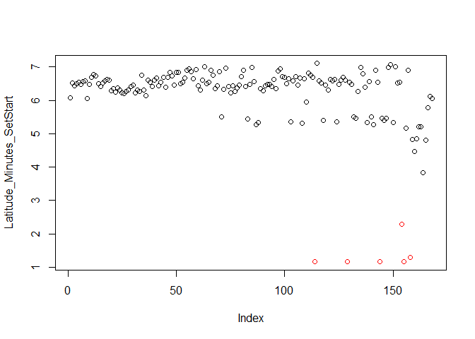
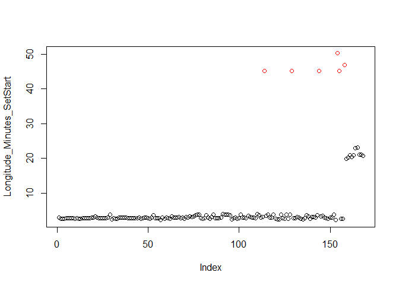
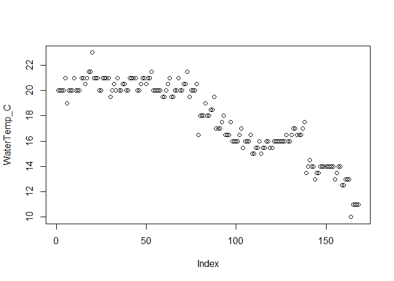

-----

-----

<!-- libraries for summary analtycis -->

<!-- variables for data entry date criteria in queries below -->

<!-- database connection string -->

<!-- begin sql queries -->

<!-- end sql queries -->

## Introduction

Data herein are extracted directly from CDFW Sturgeon database. For this
purpose, we extacted data based on data entry date greater than
2019-07-31. We look only at tagging (mark-recapture) data.

## QAQC

Follows is an informal output of summary data for various sections
(i.e., tables within the database). This crude output gives us a quick
way to find outliers we may have missed during line-by-line edits.

#### Tagged Sturgeon

Table of net sets per date. `1` indicates no fished tagged.

    ## 29 x 6 sparse Matrix of class "dgCMatrix"
    ##             NetSetNumber
    ## Date         1 2 3 4 5 6
    ##   2019-08-19 1 . . . . .
    ##   2019-08-20 . . . 1 1 .
    ##   2019-08-27 . . . . 1 .
    ##   2019-08-29 . 1 . . . .
    ##   2019-09-03 1 . . 1 . .
    ##   2019-09-04 . . . . 1 .
    ##   2019-09-05 . . . 1 1 .
    ##   2019-09-18 1 . . 1 . .
    ##   2019-09-23 . . . 1 . .
    ##   2019-09-24 . . . 1 1 .
    ##   2019-09-26 . 1 . . . .
    ##   2019-10-07 1 . 1 1 . .
    ##   2019-10-08 1 1 . . . .
    ##   2019-10-09 1 1 . . . .
    ##   2019-10-10 . . 1 . 1 .
    ##   2019-10-14 . 1 1 1 . .
    ##   2019-10-15 . . 1 1 . .
    ##   2019-10-16 1 . . . . .
    ##   2019-10-17 1 1 . . . .
    ##   2019-10-21 1 . . . 1 .
    ##   2019-10-22 1 1 1 1 1 .
    ##   2019-10-23 . 1 1 . . .
    ##   2019-10-24 1 . 1 . . .
    ##   2019-10-29 1 . . . 1 .
    ##   2019-10-30 . 1 . . . 1
    ##   2019-11-19 . 1 . 1 1 .
    ##   2019-11-21 1 . 1 1 . .
    ##   2019-11-25 . . . . 1 .
    ##   2019-11-26 1 1 . . 1 .

Total count of net sets where no fish were tagged: 58.

    ## $Species
    ## Species
    ## Green Sturgeon White Sturgeon 
    ##              2            251 
    ## 
    ## $DiscPre
    ## DiscTagPrefix
    ##   FF   HF   HH <NA> 
    ##   77   78   77   21 
    ## 
    ## $Mesh
    ## TrammelNetMeshSize
    ##   6   7   8 
    ##  47  69 137 
    ## 
    ## $FLen
    ## [1]  58 188
    ## 
    ## $FLenNA
    ## [1] 1
    ## 
    ## $SpeciesNA
    ## [1] 0
    ## 
    ## $PitTagRange
    ## [1]    45 37326
    ## 
    ## $PitTagNA
    ## [1] 55
    ## 
    ## $DiscPit
    ##           IsPitNA
    ## DiscPrefix FALSE TRUE
    ##       FF      57   20
    ##       HF      62   16
    ##       HH      58   19
    ##       <NA>    21    0

#### Sturgeon (other)

Sturgeon not tagged with either a disc or PIT or both.

    ## $Species
    ## Green Sturgeon White Sturgeon 
    ##              1             18 
    ## 
    ## $Mesh
    ##  6  7  8 
    ## 10  7  2 
    ## 
    ## $FLen
    ## [1]  50 107
    ## 
    ## $FLenNA
    ## [1] 0

#### Net Sets

Count of NA values in each field.

    ##         Date   VesselName NetSetNumber 
    ##            0            0            0

Date range | range net set numbers | count of net sets by vessel

    ## [1] "2019-08-19 UTC" "2019-11-26 UTC"

    ## [1] 1 6

    ## 
    ## New Alosa 
    ##       168

Checking deployment and retrieval times. No rows indicates times are
good.

    ## [1] NetSet_ID             Date                  NetSet_TimeStart     
    ## [4] NetSet_TimeEnd        NetRetreive_TimeStart NetRetreive_TimeEnd  
    ## <0 rows> (or 0-length row.names)

    ## $AnyIdNA
    ## [1] FALSE
    ## 
    ## $NetLoc
    ##          Location
    ## AmtNetOut San Pablo Bay Suisun Bay
    ##       4/8            10        158
    ## 
    ## $NetSets
    ## NetSetNumber
    ##  1  2  3  4  5  6 
    ## 34 34 34 33 31  2

#### Lat & Lon

Colored points in plot indicate where longitude degrees \< 122.

    ##                  NetSet_ID  Latitude_Degrees_SetStart 
    ##                          0                          0 
    ##  Latitude_Minutes_SetStart Longitude_Degrees_SetStart 
    ##                          0                          0 
    ## Longitude_Minutes_SetStart 
    ##                          0

<!-- --><!-- -->

    ## $Degrees
    ##     Lon
    ## Lat  121 122
    ##   38   6 162
    ## 
    ## $RangeLatMin
    ## [1] 1.159 7.102
    ## 
    ## $RangeLonMin
    ## [1]  2.253 50.179

#### Environmentals

<!-- -->

    ##              TidalState
    ## BeaufortScale Ebb Flood Slack
    ##             0   3     5     3
    ##             1   7    18     3
    ##             2  21    23     7
    ##             3  16    18     4
    ##             4  21    18     1

#### Pinnipeds

    ##              NetSet_ID        NumSealsNearNet     NumSeaLionsNearNet 
    ##                      0                      0                      0 
    ##        SealsRaidingNet     SeaLionsRaidingNet OtherVesselInteraction 
    ##                      0                      0                      0

    ## $Raiding
    ##      SeaLions
    ## Seals Yes  No
    ##   Yes   0   1
    ##   No    0 167
    ## 
    ## $SealsNear
    ## [1] 0 1
    ## 
    ## $SLionsNear
    ## [1] 0 2
    ## 
    ## $OtherVesl
    ## Yes  No 
    ##   0 168

#### ByCatch

    ## $Salmon
    ## , ,  = FALSE
    ## 
    ##            
    ##             Bright Dark Off
    ##   Dead           2    0   0
    ##   Excellent      0    0   0
    ##   Fair           2    0   2
    ##   Good           1    0   0
    ## 
    ## , ,  = TRUE
    ## 
    ##            
    ##             Bright Dark Off
    ##   Dead           5    0   2
    ##   Excellent      1    0   0
    ##   Fair           4    1   2
    ##   Good           3    0   5
    ## 
    ## 
    ## $DescStats
    ##      7-Gill Shark Bat Ray Brown Smoothhound California Halibut Chinook Salmon
    ## NAll 6            2       2                 14                 30            
    ## N    6            2       2                 13                 30            
    ## Min  68           70      98                44                 48            
    ## Max  105          80      102               68                 90            
    ## Avg  90.16667     75      100               56.46154           75.1          
    ## Med  95.5         75      100               57                 77.5          
    ## Var  264.5667     50      8                 63.10256           99.74828      
    ##      Leopard Shark
    ## NAll 5            
    ## N    5            
    ## Min  95           
    ## Max  132          
    ## Avg  109.4        
    ## Med  110          
    ## Var  229.8

    ## $SpecFreq
    ## Species
    ## Starry Flounder    Striped Bass            <NA> 
    ##              12               9             147 
    ## 
    ## $SpecCount
    ##           Species  x
    ## 1 Starry Flounder 18
    ## 2    Striped Bass  9
    ## 
    ## $NetSetIdsNA
    ## [1] 147
    ## 
    ## $DateRange
    ## [1] "2019-08-19 UTC" "2019-11-26 UTC"

-----

CDFW, SportFish Unit  
Sturgeon Tagging Data QAQC  
2019-12-06 09:12:56
