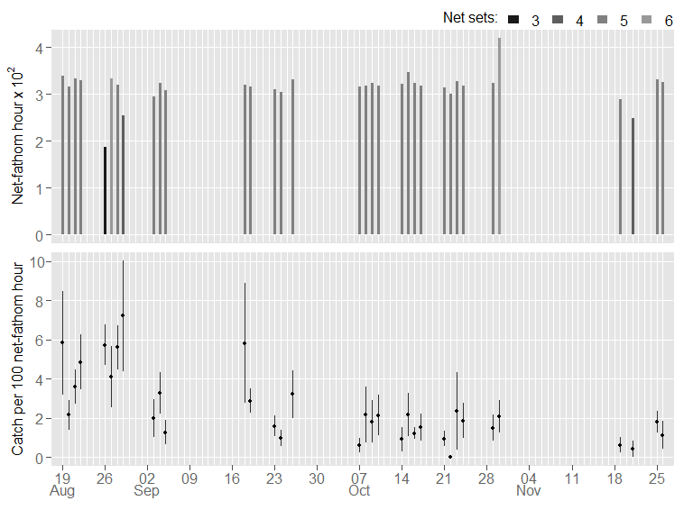

\#\#\#Tagging Season Reports \#\#\#By Jason Dubois \#\#\# 4/16/2020 —

-----

<!-- ## Analytic Chunks{.hide} -->

<!-- begin analytic chunks -->

<!-- end of analytic chunks -->

## Introduction

<!-- ## Methods and Gear -->

## Field Season Summary

We set the net 168 times over 34 calendar days producing 127.2 hours
fishing time (\~10,700 net-fathom hours). Average fishing time per set
was about 45 ± 5.1 (SD) minutes. Nets were set an average of 5 times per
day per research vessel (one vessel\[s\] used this season).

We caught 272 (269 WST, 3 GST) sturgeon this season. Of the White
Sturgeon, 177 were then PIT & disc tagged, 55 disc tagged only, and 19
PIT tagged only. Of the Green Sturgeon, 2 were then PIT tagged. Of the
sturgeon catch, 18 White Sturgeon and 1 Green Sturgeon received no tag.
We recorded no recaptures this season.

#### Green Sturgeon

#### PIT Tagging

## Sampling Effort and Catch-per-unit-effort (CPUE)

<!-- narrative here -->

#### Daily (Current Field Season)

Average daily CPUE for legal-sized (102-152 cm FL) White Sturgeon was
1.30 ± 0.16 (SE) and for all sizes of White Sturgeon was 2.51 ± 0.31
(SE). Average daily CPUE per drift (net set) for all sizes of White
Sturgeon was greatest on 29-Aug (7.21 ± 2.82 (SE); Figure below).

<!-- -->

#### Annual (All Field Seasons)

Average monthly CPUE for all sizes of White Sturgeon declined during our
field season: 4.76 (Aug; n=38); 2.63 (Sep; n=40); 1.53 (Oct; n=71); 1.03
(Nov; n=19) . Catch per 100 net-fathom hour of White Sturgeon within the
current slot limit (102-152 cm FL) was 1.28 ± 0.13 (SE), a value below
the historical (period) average of 2.5, but comparable to the prior
sampling year (2017).

<!-- -->

<!-- -->

## Length Frequency

<!-- -->

## ByCatch

| Species            | Count |
| :----------------- | ----: |
| 7-Gill Shark       |     6 |
| Bat Ray            |     2 |
| Brown Smoothhound  |     2 |
| California Halibut |    14 |
| Chinook Salmon     |    30 |
| Leopard Shark      |     5 |
| Starry Flounder    |    18 |
| Striped Bass       |     9 |

| Species            | Sex    |  N | Min | Max |   Avg |   Med |   Var |
| :----------------- | :----- | -: | --: | --: | ----: | ----: | ----: |
| 7-Gill Shark       | Female |  6 |  68 | 105 |  90.2 |  95.5 | 264.6 |
| Brown Smoothhound  | Female |  1 | 102 | 102 | 102.0 | 102.0 |    NA |
| Leopard Shark      | Female |  2 | 110 | 132 | 121.0 | 121.0 | 242.0 |
| Bat Ray            | Male   |  1 |  70 |  70 |  70.0 |  70.0 |    NA |
| Brown Smoothhound  | Male   |  1 |  98 |  98 |  98.0 |  98.0 |    NA |
| Leopard Shark      | Male   |  3 |  95 | 114 | 101.7 |  96.0 | 114.3 |
| Bat Ray            | unk    |  1 |  80 |  80 |  80.0 |  80.0 |    NA |
| California Halibut | unk    | 13 |  44 |  68 |  56.5 |  57.0 |  63.1 |
| Chinook Salmon     | unk    | 30 |  48 |  90 |  75.1 |  77.5 |  99.7 |

## Pinnipeds

In Suisun Bay, we observed a per-set average of 0.02 (± 0.18 SD) sea
lions and 0.03 (± 0.16 SD) seals within 50 meters of the net. We
observed pinnipeds raiding the net during 0% (sea lions) and 0.63%
(seals) of net sets. In San Pablo Bay, we encountered no pinnipeds.

## Collaboration

For the San Francisco Estuary Institute, we collected muslce plugs from
81 White Sturgeon with fork lengths 63-187 cm (Figure below).

<!-- -->

## Tag Sequence

| TagVal | From   | To     | N  |
| :----- | :----- | :----- | :- |
| $ 50   | FF2422 | FF2498 | 77 |
| $ 100  | HH2421 | HH2456 | 36 |
| $ 100  | HH2458 | HH2498 | 41 |
| $ 150  | HF2421 | HF2498 | 78 |

-----

CDFW, SportFish Unit  
2020-11-04
