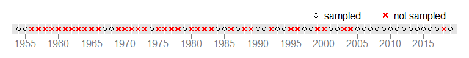
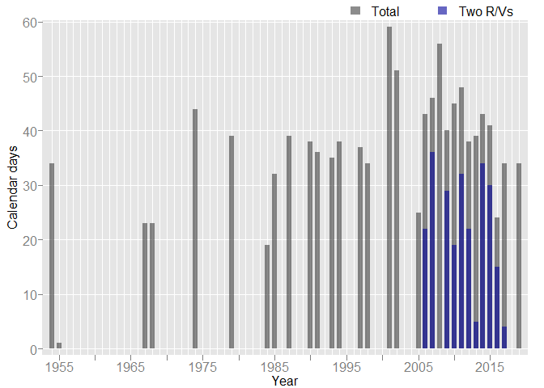
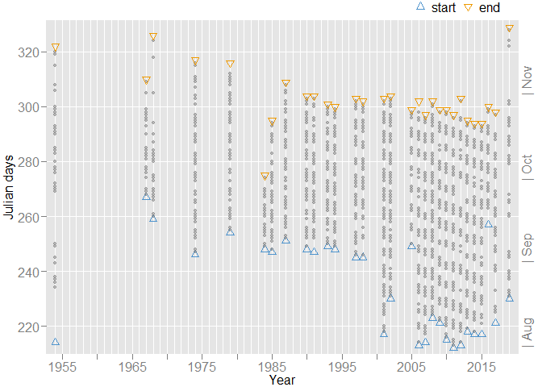
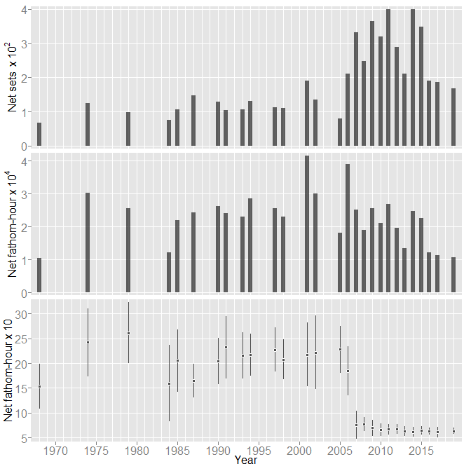
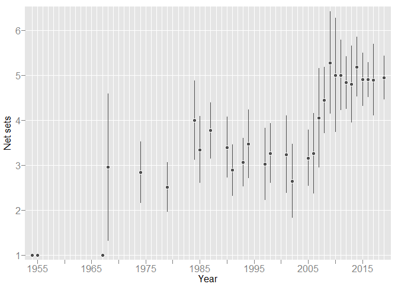
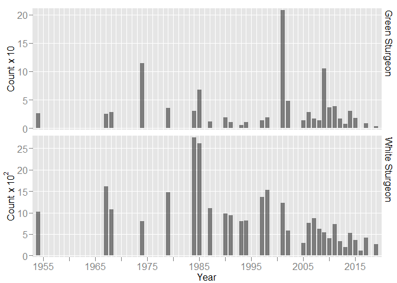
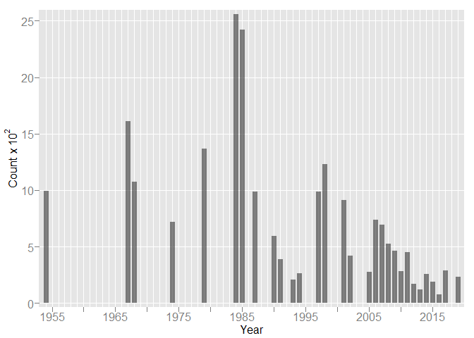
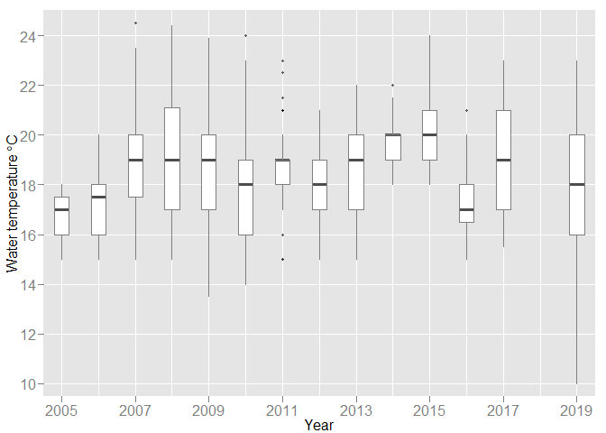
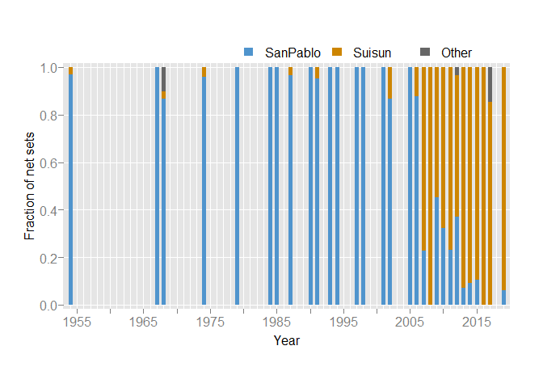
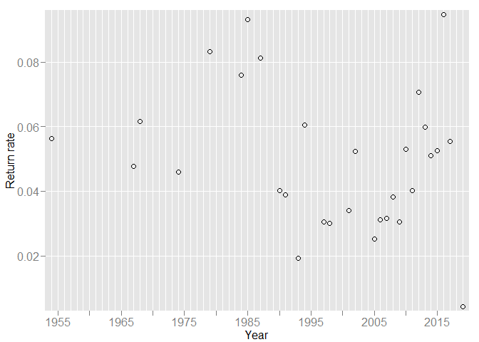

The California Department of Fish and Wildlife’s (CDFW) Bay Delta
(Stockton) Sportfish Unit provides herein a detailed review of the adult
sturgeon population study. Such a review was requested by Interagency
Ecological Program (IEP) management. This review chronicles the study’s
history, evaluates original objectives with the needs of today, and
provides recommenations for improvements.

March 02, 2020  
CDFW, Sportfish Unit

# Basic Information & Program Element Description

<!-- Basic Information & Program Element Description -->

**Program Title**: Adult Sturgeon Population Estimates  
**Program Element Number (PEN)**: 005  
**Agency**: California Department of Fish & Wildlife (CDFW)

Principal Investigators:  
\- [Andrew Danos, CDFW](mailto:andrew.danos@wildlife.ca.gov)  
\- [Jason DuBois, CDFW](mailto:jason.dubois@wildlife.ca.gov)

## Project Description

This program provides estimates of abundance, relative abundance,
harvest rate, and survival rate for White Sturgeon (*Acipenser
transmontanus*) using data from mark-recapture (tagging), commercial
passenger fishing vessel (CPFV) logbooks, and anglers (by way of the
Sturgeon Fishing Report Card \[Card\]). Further, this program provides
some information (e.g., numbers caught and released by anglers) for
Green Sturgeon (*A. medirostris*) caught as by-catch in the White
Sturgeon fishery. Data are limited for Green Sturgeon — the rarer of the
two species — and thus calculation of reliable population metrics is
infeasible. Despite *Adult* in the program’s title, using data from
CDFW’s San Francisco Bay Study this program provides young-of-year
(YOY) indices for both sturgeon species.

#### Research Problem

#### Research Objectives

One primary objective is to provide reliable and up-to-date population
metrics for California-based anadromous White Sturgeon. Such metrics
might include estimates of abundance, harvest rate, and survival rate.
Data sources are listed below.

  - mark-recapture (late summer - fall sampling in Suisun & San Pablo
    bays using trammel nets to catch mostly adult sturgeon)
  - annual sturgeon report card (required by anglers fishing for
    sturgeon in California)
  - annual Commercial Passenger Fishing Vessel (CPFV) logs of catch &
    keep and catch & release (required for each fishing trip); provides
    measure of relative abundance
  - otter trawl catch from San Francisco Bay Study sampling; provides a
    young-of-year (YOY; age-0) recruitment index

The various population metrics (estimates) will guide sound management
of our White Sturgey fishery. Further, these metrics may support
recommendations for regulartory changes should data warrant such
actions.

#### Research Questions

1)  What are the population dynamics of White Sturgeon in the
    Sacramento-San Joaquin Delta and San Francisco Estuary?

2)  Do existing laws governing the fishery need to be changed?

3)  Are there any regulatory recommendations needed to maintain or
    increase the White Sturgeon population?

<!-- project's relation to IEP science strategy & Delta Science Action Agenda -->

# Program Element Historical Details

<!-- Program Element Historical Details -->

## Study Design & Objective

We (CDFW) use trammel nets to catch mostly adult sturgeon. Sampling
occurs late summer to mid-fall (Aug-Oct) typically in Suisun and San
Pablo bays. The objective is to catch and then disc tag as many sturgeon
as possible. We use 100 to 200 centimeters total length (cm TL) as
criteria for tagging. Fish \< 100 cm TL are enumerated and measured.
Fish \> 200 cm TL may receive a disc tag if it is safe — to the fish and
crew — to do so.

Sturgeon deemed “taggable” receive a single disc tag just below the
dorsal fin on the right side. Disc tags are sequentially numbered with a
6-character alpha-numeric (i.e., the tag number). Along with tag number,
fork length (in centimeters \[cm\]), trammel mesh size, and fish
condition at release (good; fair; poor) are recorded. Noted too is any
evidence of a captured fish having shed a disc tag and (or) if a
captured fish needed to be re-tagged.

Sampling typically occurs Monday through Thursday from roughly dawn
until early afternoon. The trammel net is set in locations selected by
the boat operator to avoid known snags and unfavorable currents. The net
is deployed cross current with the vessel downwind. On average, it takes
approximately five minutes to set the net. We continuously monitor the
deployed net to detect snags, tangles, marine mammal interactions, and
to avoid conflicts with other vessels and hazards such as channel
markers. The net is set as many times (usually 4-6) as possible each
field day, with each set lasting up to 40 minutes.

We record the following information for each net set. Further, we note
any unusual procedures (e.g., had to pull net early due to possible
snag).

  - net length
  - general geographic area (e.g., Suisun Bay)
  - latitude & longitude at the start of the net set
  - start & end times for net set & net retrieval
  - personnel (disc tagger & data recorder)
  - tidal state (as ebb, floor, or slack)
  - wind & wave conditions based on the Beaufort scale (0-12)
  - water temperature (to nearest 0.5 degree Celsius)
  - number of pinnipeds (seals or sea lions) within 50 meters of the net
  - pinnipeds raiding the net (yes or no)
  - other vessel interactions (yes or no)

<!-- <TODO: more narrative for study description / design here> -->

<!-- - objective with data (mark-recapture) -->

#### changes (come up with more descriptive section name)

Up until 2002, we only disc tagged legal-sized sturgeon. Beginning in
2005, we attempted to disc tag every sturgeon but smaller fish (i.e., \<
100 cm TL) proved challenging with tag placement in relation to longterm
growth.

In 2013, responding to concers from National Marine Fisheries Services
(NMFS) about handling listed species we stopped disc tagging Green
Sturgeon. Regulations now restrict anglers from removing Green Sturgeon
out of the water, and we catch too few Green Sturgeon to make any
reliable estimates using disc tag information.

In 2007 and again in 2019, we implanted passive integrated transponders
(aka PIT tags) into a portion of our sturgeon catch.

## Sampling Period & Sampling Locations

This program has sampled nearly annually from 2005, prior to which
sampling was irregular. It began in 1954, but sampling with some
consistency did not materialize until the mid 1980s. We conduct
fieldwork late summer through mid fall.

Sampling locations have favored Suisun and San Pablo bays. We do not
have specific sampling stations bounded by established waypoints and
thus sample whereever we think we can (1) safely fish the net and (2)
maximize our catch.

<!-- <TODO: more narrative including map of sampling locations> -->

## Gear Description

<!-- drift trammel nets (construction ?) -->

Our trammel net is a passive gear type (e.g., drift net; \<TODO: add
citation\>). It is configured as 4\<-8\> contiguous panels, with each
panel 45.72 m (L) x m 3.66 (D) \[150 ft (L) x 12 ft (D)\].

\<TODO: explain inner & outer webbing, design, etc.\>

## Effort

We deploy our trammel net from the vessel’s stern using a
hydraulic-powered net reel. Catch and weather (e.g., currents; wind) can
dictate the number of daily deployments, but typically a vessel will set
the net 5± times. Net set and net retrieval times are recorded to the
nearest minute (as `HH:MM`).

We use set and retrieval times to calculate fishing effort (see
equations below). True soak time — or if not available estimated soak
time — is then multiplied by net length (usually fathoms).

+0.5\\times(\\text{nre} - \\text{nrs})+0.5\\times(\\text{nse} - \\text{nss})}")

")

where:  
\- `nss` = net set start  
\- `nse` = net set end  
\- `nrs` = net retrieve start  
\- `nre` = net retrieve end

<!-- *Note*: explain 0.5 in true soak time -->

*Note*: If soak time is `NA`, then estimated soak time is 1.067.

<!-- <TODO: describe soak times; number sets per location per day; Describe how gear is used per site visit (Include table summarizing number of samples per gear type and sampling period (e.g. per month) per year.)> -->

## Required Resources

At minimum, this study requires the following “big ticket” items.

  - research vessel with hydraulic net reel & one tagging cradle
  - at least one complete 4-panel trammel net (or raw materials to build
    one)
  - 1-2 replacement panels (in case of in-season damage)
  - serially numbered disc tags (count: \~400 to begin each season)
  - PIT tags (count: \~400 to begin each season)
  - 4-5 personnel
      - Vessel Mate
      - Fish & Wildlife Technician (deck hand)
      - Environmental Scientist (or similar scientific staff)
      - Scientific Aide (1 or 2 depending on needs and availability)

## Initial Sampling Purpose

??

<!-- 21-Feb-2020 @ 1415 -->

<!-- MORE Program Element Historical Details -->

<!-- Andrew's writing below - decided for now to keep it all together for flow & readability -->

## Project History

Prior to 1954, fishing for both White Sturgeon (*Acipenser
transmontanus*) and Green Sturgeon (*A. medirostris*) had been closed
since 1917. On the recommendation of Fish and Game personnel, the
sturgeon sport fishery reopened April 1954 with a daily bag limit of one
fish ≥ 40" and no annual bag limit or seasonal closure. To further
assess the future and impact of this new sport fishery, a White Sturgeon
life history study began July 1954. This project’s objectives were to
observe the growth of the fishery and to learn enough of the life
history to evaluate and improve existing regulations (Pycha
[1956](#ref-pycha-1956)). This work would set off a series of projects
that would attempt to find out important information about the
little-known data of White Sturgeon in Northern California. The studies
would be labeled and funded as California project F-9-R, “A Study of
Sturgeon and Striped Bass,” which was supported by Federal Aid to Fish
Restoration Funds.

Sturgeon were caught using salmon trammel nets deployed in San Pablo Bay
from August to November 1954. In all, 1,003 sturgeon were double tagged
using variations and combinations of three different types tags and
locations on the fish (Chadwick [1959](#ref-chadwick-1959)). Fin rays of
some fish were also collected for aging. Using recapture data from
previous tagging days in the season, Pycha ([1956](#ref-pycha-1956))
estimated the San Pablo Bay White Sturgeon population at just over
11,000 individuals. Although few, disc tags reported by anglers
suggested a winter or spring up-stream migration and summer downstream
migration of large fish. Fin ray data suggested 40" fish were roughly 8
years old. Pycha ([1956](#ref-pycha-1956)) suggested the minimum harvest
limit be raised to 50" to allow for maintenance of spawning stock.

Chadwick ([1959](#ref-chadwick-1959)) analyzed disc tag returns from
Pycha’s 1954 <citation> tagging study to estimate fishing mortality rate
and further investigate sturgeon migration. The 1954 tagging study
experienced low tag returns, in large part due to bycatch and
non-reporting of tagged sturgeon in commercial salmon and shad nets.
Commercial salmon and shad fishing were later outlawed in California in
1957. Understanding that most of the 1954 tag returns had probably been
received by 1959, Chadwick ([1959](#ref-chadwick-1959)) decided to
finalize the fishing mortality estimate for Pycha’s 1954 study. The
study determined that 2-10% of the San Pablo Bay tagged sturgeon were
harvested within the first year of being tagged, and that tag returns
can provide useful harvest information for long-lived fish such as
sturgeon. The study also found that a select few of the tagged White
Sturgeon (n=1) and Green Sturgeon (n=3) had migrated along the coast and
were recaptured in Oregon (Chadwick [1959](#ref-chadwick-1959)).

From 1954 to 1963, anglers had almost no effective techniques for
catching sturgeon. In 1964, anglers discovered bay shrimp (*Crago* sp.)
greatly increased their efficiency catching sturgeon. Yearly party boat
catches rose from three sturgeon caught in 1963 to 2,400 sturgeon caught
in 1967 (Fenner and McKechnie [1971](#ref-fenner-1971)). A 1967-1968
study assessed how improved fishing techniques might affect harvest
rate. Reward tags ($5, \~$30 in 2020) were used to improve reporting
rates. Approximately half of the study’s sturgeon were double tagged to
determine tag shedding rates between anterior and posterior below dorsal
tagging locations. One thousand six hundred twelve (1,612) sturgeon were
tagged in 1967 and 1,080 sturgeon were tagged in 1968. This study
determined that the anterior dorsal tagging location resulted in more
tag returns over time
<and is where CDFW currently disc tags sturgeon to this day>.
Exploitation of sturgeon was estimated at 7.3% for 1967 and 6.5% for
1968. Miller <year> estimated the population size to be approximately
115,000 sturgeon ≥ 41“. Miller <year> also noted that this population
size supported the stay of the 40” total length minimum for sturgeon
that the regulations we currently set at (Miller
[1972](#ref-miller-1972a)[a](#ref-miller-1972a)). A subsequent study on
1967-68 tag returns was also conducted by Miller. The results suggested
that White Sturgeon inhabit the lower estuary during summer, fall and
winter, and spawning migration upriver occurs during late winter and
early spring (Miller [1972](#ref-miller-1972b)[b](#ref-miller-1972b)).

Larval Green Sturgeon and White Sturgeon were collected in the
Sacramento-San Joaquin river system by CDFW (then CDFG) in 1966, 1967,
and 1968. Almost nothing was known about the time or place of spawning
for sturgeon in California. The results of this important study
indicated that spawning occurred upstream in the Sacramento River and
that catch of sturgeon larvae in the delta was dependent on flow from
the rivers above. This also supported the theory that sturgeon migrate
upriver and spawn in rocky or gravel substrates (Stevens and Miller
[1970](#ref-stevens-miller-1970)). This project’s funding would also be
significant. In addition to the Federal Aid to Fish Restoration funds
for the F-9-R project “A Study of Sturgeon and Striped Bass,” funding
would also come from the California Department of Water Resources in
cooperation with CDFG Delta Fish and Wildlife Protection Study. The
Delta Fish and Wildlife Protection Study would start in 1961 to be the
first time in California that entities who stood to profit from
potential water exports would pay for studies to protect potentially
impacted fish and wildlife \[citation needed\].

<!-- (cant, remember exact source, but common knowledge is true, search source!!!-IEP annual report I think). -->

Sturgeon were caught and tagged via trammel nets again in 1974. This
study sought to determine the effect on survival of fin ray-clipped
fish. Fish were again tagged with $5 reward tags to increase angler
response. The results yielded that pectoral ray clipped fish had
substantial mortality within the first year of tagging. The study also
concluded that if fin ray removal was used in conjunction with a
sturgeon tagging study, the population parameter estimates derived from
tag recoveries could potentially exhibit serious bias (Kohlhorst
[1979](#ref-kohlhorst-1979)). Fin rays from fish were analyzed with
other samples (mostly CPFV and trammel collected samples) to determine
growth rates for 1965-1970 and 1973-1976 sturgeon samples. The study
determined that growth-rate was similar for 1965-1970 and 1973-1976 fish
but was lower than earlier 1954 fish. The decrease in growth-rate was
not determined if it was real or due to different aging techniques
(Kohlhorst et al.  [1980](#ref-kohlhorst-et_al-1980)).

Tagging for sturgeon in San Pablo Bay was again done in 1979 to report
updated White Sturgeon population estimates for years 1954, 1967, 1968,
1974, and 1979. The study concluded that abundance of White Sturgeon
increased from 1974 to 1979 (Kohlhorst [1980](#ref-kohlhorst-1980)).
Abundance and mortality estimates based off CDFW tagging studies were
updated in 1988 and included additional tagging years of 1984, 1985, and
1987. The results of this study estimated the exploitation rates in
1980s had increased 41% over previous years and suggested that further
restrictions on the sport fishery were needed to reduce catch and
support spawning stock (Kohlhorst et al. 
[1991](#ref-kohlhorst-et_al-1991)). A 72-inch maximum size limit was
established in 1990, and the minimum size limit was increased 2 inches
per year until a new minimum limit of 46 inches was reached by 1993
(Cech [n.d.](#ref-cech-1992); CDFW [2019](#ref-esr-wst)).

Tagging continued intermittently in the 1990s to determine if the new
1990 fishing regulations were effective. Results from the study
suggested that the new fishing regulations had reduced the exploitation
rate by at least half compared to rates of the mid to late 1980s, and
that fishing regulations did not need to change at the time. The study
stated the that continual monitoring would need to be done to assure a
sustainable population (Kohlhorst and Schaffter
[1999](#ref-kohlhorst-shaffter-1999)).

Disc tagging sturgeon in San Pablo and Suisun bays has continued since
the early 2000s, with exceptions to a handful of years when tagging did
not occur to due to personnel and equipment/vessel issues \<are we sure
about this?\>. Historic tagging locations, gear, and methods have mostly
remained the same, with few exceptions. In 2007, trammel net lengths and
net soak times were reduced by half to mitigate potential pinniped
interactions. From 2007 to 2019, tagging effort was mostly directed to
Suisun Bay. In 2019, only the R/V *New Alosa* was used. Since 2005,
mostly two vessels have been used for tagging sturgeon, but in 2018 the
aging 52-year-old R/V *Striper II* was processed to be surveyed and
released by the State of California (CDFW-Sportfish Date; CDFW-Andrew
Danos).

Blackburn et al. ([2019](#ref-blackburn-et-al-2019)) developed a model
using CDFW Region 3 data that aimed to evaluate the population dynamics
for White Sturgeon in the Sacramento-San Joaquin Estuary and use the
information to estimate the population-level response under plausible
management scenarios. The idea was to develop a model that would project
population growth or decline depending on exploitation rate and be able
to adjust exploitation rate and “game” the system to see what that would
do to the population. Blackburn et
al. ([2019](#ref-blackburn-et-al-2019)) used mark-recapture data from
2007-2016. Blackburn et al. ([2019](#ref-blackburn-et-al-2019)) also
used recent estimates of slot-limit population size of 48,000 fish age 3
and older for the model, and used 10%, 15%, and 25% spawning
periodicities.

# Current Resource Requirements

# Program Strengths & Weaknesses

<!-- strengths & weaknesses -->

<!-- possibilities for discussion 25-Feb-2020 -->

<!-- [not a sampling change per se] reward denominations -->

<!-- [not a sampling change per se] fin ray collection -->

<!-- recorded total length until 2013 (when regs changed) then fork length -->

<!-- tagged greens and whites through 2012 stopped disc tagging greens in 2013 -->

<!-- began recording effort 1968 (?) -->

<!-- did we gain anything by annual sampling beginning 2005? -->

## Sampling

Below we display a sampling timeline covering the project’s history.
*Note*: we sampled only one day in 1955 (21-Jan).

<!-- -->

It is not entirely clear why — prior to 2005 — sampling was so
intermittent. We speculate in absence of routine practices, sampling
followed observations of increased annual harvest. Such increases
warranted data collection via mark-recapture to ensure current
regulations were sufficiently protecting the fishery.

Below, we show reasons for not sampling certain periods. Our default
(“still investigating”) is more-or-less a placeholder for our
speculation. It is possible sampling in the 1990s and early 2000s
followed suit with Striped Bass: periodic sampling rather than annual
was sufficient. However, we have found no evidence to support this
notion.

| Period    | Reason                                |
| :-------- | :------------------------------------ |
| 2018      | vessel issues & personnel redirection |
| 2003-2004 | still investigating                   |
| 1999-2000 | still investigating                   |
| 1995-1996 | still investigating                   |
| 1992      | still investigating                   |
| 1988-1989 | still investigating                   |
| 1986      | still investigating                   |
| 1980-1983 | still investigating                   |
| 1975-1978 | still investigating                   |
| 1969-1973 | still investigating                   |
| 1956-1966 | still investigating                   |

## Sampling Changes

#### Trammel Net

<!-- See Pycha 1956 for net dimesions in 1954 -->

Back to at least 1968, our trammel net was configured as 8 x 25 fathom
\[metrics?\] contiguous panels, for a total length of \~200 fathoms
\[\]. In the mid-2000s, we were having issues with pinniped
interactions. To mitigate marine mammal entaglement, for the vast
majority of sets in 2007 and all sets starting in 2008, we reduced in
half trammel net length (to \~100 fathoms or 4 contiguous panels).

Prior to 1990, our trammel net was uniformily 8-inch mesh. Beginning in
1990 and continuing to present day, we added mesh sizes 6- and 7-inch.
The full net (i.e., \~200 fathoms) was then configured as
8-7-6-8-8-7-6-8 <verifiy> and the half net thus was 8-7-6-8. We added
smaller mesh in response to the newly-instituted (i.e., in 1990) legal
size slot limt <verify this is the reason why>. The idea being that we
would catch more smaller sturgeon.

changes in net materials (nylon, monofilament ?)

#### Sampling Effort

<!-- fishing time reduced (for pinniped mitigation) -->

Sampling year 2006 was unintentionally hard on pinnipeds (Schreier
unpublished [2007](#ref-mmdet-2007)). To mitigate pinniped interactions
and pinniped entanglements, starting with the 2007 season we reduced to
half trammel net length and reduced to about 30 minutes net soak time.
We continue to implement these modifications.

<!-- shift in sampling from Sep & Oct to include Aug, some Nov sampling -->

Beginning in 2001, we expanded sampling to include August. Green
Sturgeon catch had decreased noticeably in previous years during routine
sampling (i.e., Sep-Oct). Biologist believed more Green Sturgeon might
be caught if sampling inlcuded late summer (i.e., August), a migration
period into the estuary (Kogut [2002](#ref-kogut-2002)). *Note*: prior
to 2001, only the inagural season (1954) sampled in August.

<!-- shift from a few net sets per day to 5-6 per day -->

Coincident with a reduction in soak time was an increase in number of
net sets per day. Since roughly 2008, our target has been 5 net sets per
day per vessel. For most of this project’s history, 3-4 net sets per day
per vessel was the norm.

#### Tagging

Up until 2005, we disc tagged only legal-sized fish (for the most part).
From 2005 to 2007, we disc tagged fish below and above the legal slot
limit (even tagging one fish in 2007 at 42 cm TL). Beginning in 2008, we
instituted a range of 100 cm TL to 200 cm TL, as it proved challenging
to disc tag very small & very large sturgeon. The range was simply a
guideline, and it was not clear why in 2005 we changed this tagging
criterion.

In 2007 and again in 2019, we inserted into a portion of our catch a
single passive integrated transponder (aka PIT tag). Personnel turnover
and management indifference were likely reasons for the long hiatus
between PIT tag releases.

In a collaborative effort, University of California at Davis (UC Davis)
researchers joined our team for field seasons 2009, 2010, and 2011 to
insert into a portion of our sturgeon catch acoustic tags (\<make, size,
duration, etc.\>). Roughly 100± acoustic tags were implanted into mostly
White Sturgeon. To date, the CDFW Sportfish Unit has not analyzed any
acoustic tag dataset for tag detections. Likely, such analytics were
done by UC Davis personnel (\<citations?\>).

#### Research Vessels

In 2006, we employed two research vessels (R/V) for the first time since
the study’s inception. We continued using two vessels through 2017, with
2008 excepted. In 2019, only the R/V *New Alosa* was available for
sturgeon tagging.

## Evaluating Effort & Efficacy

<!-- a. What is the program element staff doing to continually assess and improve the long-term monitoring effort in support of management priorities? Please provide short responses for each of the categories listed below:  -->

<!-- i. Assess and incorporate new variables -->

<!-- ii. Field or analytical studies to assess current & new sampling methods -->

<!-- iii.   Analytical studies to evaluate current and new analytical methods -->

<!-- iv.    Evaluation of new technologies or new gear types -->

<!-- v. Review and improve monitoring program element processes -->

<!-- vi.    Using historical information to change the program element design -->

<!-- vii.   Other -->

In the recent two decades, this program has done little in terms of self
assessment and (or) self improvment. We have been plagued by personnel
turnover, truncated field seasons due to vessel issues and (or)
redirection of staff to higher priority projects, insufficient expertise
in the fields of fishery management and mark-recapture, and lack of
formal fishery management plan. Despite these drawbacks, we have made
some changes along the way.

<!-- ability to incorporate new variables -->

#### Incorporate New Variables

CDFW biologists began recording in 2005 water temperature and in 2007
tidal state (as ebb, floor, or slack) and wind and wave action per the
Beaufort scale. In 2006, biologist began recording latitude and
longitude for each net deployment. Though not expressly stated, it is
possible collection of these additional variables would improve our
ability to locate and catch sturgeon.

<!-- ability to implement new sampling methods -->

#### New Sampling Methods

??

<!-- evaluation of new gear types -->

#### Gear Evaluation

Starting in 1990, we added 6" and 7" mesh sizes to our net
configuration. Presumably, targetting smaller sturgeon was the impetus
behind such modification. To date, we have not statisically analyzed
catch (or fish length) by mesh size.

<!-- improvements over time -->

#### General Improvements

In 2015, we changed our reward denominations from $20, $50, and $100 to
$50, $100, and $150. The $20-$50-$100 configuration began in 1998, and
we felt to improve reporting (return) rates an increase was necessary.

## Bycatch (Other Species)

Below, we display the top 10 (in overall numbers) bycatch species. We
began recording bycatch in 1954\[^1\] (electronic records available from
1974), and `Count` includes all sampling years since 1974 This project
has caught very few Steelhead (n=5). We have collected — though not
consistently — length data for elasmobranchs, California Halibut, and
salmonids. Sex data collected for elasmobranchs.

| Species            | Count |
| :----------------- | ----: |
| Bat Ray            | 6,870 |
| Chinook Salmon     | 3,044 |
| Leopard Shark      | 1,788 |
| Starry Flounder    | 1,024 |
| California Halibut |   681 |
| Striped Bass       |   475 |
| Diamond Turbot     |   252 |
| 7-Gill Shark       |   206 |
| Brown Smoothhound  |   143 |
| White Croaker      |   137 |

# Data Products

## Data Storage

Data are stored in a Tier 3 level server-based database (MS SQL Server;
database name: `BDSturgeonTagging`). Data are accessed via two
applications: `Managed Access Login` or
`SturgeonTaggingDatabaseQueries.mdb`. These applicatons are accessible
only on CDFW-Stockton based computers. Data backup is handled via
methods established by the database administrator (of CDFW’s Data
Technology Division).

## Data Collection & Data Management

Field data are recorded on one of four datasheets: (1) header
<better description>; (2) tagging; (3) by-catch; and (4) salmonids. ~~We
record data for each net set per vessel irrespective of catch (e.g., no
fish).~~ At the end of each sampling day, a crew member reviews each
datasheet for completeness and accuracy. Field crew return all
datasheets to CDFW’s Stockton Office, where an Environmental Scientist
reviews for completeness and accuracy, editing as needed.

New data are entered via `Managed Access Login`, and quality assurance
is enforced through line-by-line inspection of data printouts (i.e.,
hardcopies). We then randomly select 10% of data for a final
line-by-line review.

\<TODO: Data Management Plan can be included if it exists\>

## Data Analysis

Currently, we use R & RStudio for all data analytics (R version 3.6.2
(2019-12-12); RStudio version `1.2.5033`). Data are queried through open
database connectivity established with the server-based
`BDSturgeonTagging`. We use SQL (structured query language) to extract
desired data, and then save such extracts as `.rds` files for use in R &
RStudio. We update each `.rds` file when appropriate (i.e., with new
data).

*Note*: we completed and compiled this report using R packages
`sportfish` ([2018](#ref-sportfish-2018)) and `knitr`
([2020](#ref-knitr-2020)). File organization and R code can be found
[here](https://github.com/jasondubois/StripedBassPopMetrics/tree/master/review).
Find appropriate `.Rmd` (Rmarkdown) file.

#### Population Metrics

Detailing the steps and methods that produce various population metrics
is beyond the scope of this report. Three such metrics are abundance,
harvest rate, and survival rate, for which the algorithms can be found
in Ricker ([1975](#ref-ricker-1975)), see equations 3.9, 3.1, & 5.1.

Estimating abundance is a multi-step process. Because estimating
abundance requires the number of recaptured marks (tags), it takes four
years (i.e., seasons) before we consider estimates final. Estimating
harvest rate includes adjusting for non-response all angler tag returns
not collected directly (e.g., returned via mail). Ricker’s
([1975](#ref-ricker-1975)) survival rate algorithm (5.1) requires two
consecutive sampling seasons.

We calculate tagging catch-per-unit effort (CPUE) as a measure of
relative abundance. Further, we can measure migration on a crude scale
(i.e., tagging location versus recapture location). We can estimate
annual growth rate given available length-at-age data.

## Data Dissemination

Raw data are available upon request. We can provide a standalone copy of
`BDSturgeonTagging` with necessary queries. As needed or requested, we
can provide data extracts in spreadsheet format (e.g., `.xlsx` or `.csv`
files).

## Manuscripts | Newsletters | Memos | Reports

We have published — though nothing in 10+ years — in peer-reviewed
journals (e.g., *California Fish & Game*). Recent publications include
IEP Newsletters and field season summary reports (from 2006 onward).
Further, we have written memorandums as summaries of brief analytics or
special projects.

We make most of these documents available through our bibliography page
accessed at the link below. New documents are added or old documents are
updated internally through the Departments’s Document Library.

<!-- presentations ? -->

<https://wildlife.ca.gov/Conservation/Delta/Sturgeon-Study/Bibliography>

## Current Deliverables

For 2019, we completed the following deliverables:

1)  applied individually-numbered disc tags to White Sturgeon (Aug-Nov)
2)  reported on 2019 fieldwork (Jan 2020)
3)  corresponded with angers who reported catching disc tagged White
    Sturgeon (ongoing)
4)  managed associated databases (ongoing)

<!-- For some time now, we have not produced at regular intervals some important population metrics (e.g., absolute abundance; harvest rate; survival rate). Our goal is to provide within this report a few key metrics, and then make recommendations for providing regular (i.e., annual) updates. -->

# Data Customers

## Primary Users

We are the primary users. Over the last decade, a few entities have
requested portions data but none request our data at regular intervals
(e.g., annually). We supply (or should supply) annual estimates of
harvest rate, survival rate, abundance (absolute & relative), and
harvest.
<!-- Alas, we have fallen short in our timeliness of calculating such metrics. -->

Recent users have been University of Idaho who used our trammel net data
(2014-2016) in a White Sturgeon population model. The model is available
in publication (<HERE>), but we are still working on an interactive
version to facilitate our understanding on how the model’s input
parameters affect output.

\<more here, other users?\>

## Customer (User) Needs

<enhanced status review>

# Recommendations

<!-- recommendations & comments -->

## Recommendations

Herein, we outline recommendations for consideration. We feel such
recommendations (1) provide a clear path forward for the `Adult Sturgeon
Population Estimates` study, (2) establish and ensure robustness in data
collection and analytics, and (3) offer novel opportunities to further
our understanding of California-based sturgeon.

Sections `Sampling` and `Analytics` offer the most detail. We considered
analytics from an operational standpoint. That is, analytics (and
outcome) that could possibly improve sampling and (or) population
metrics.

#### Population Metrics

Because we have not done so recently, calculate and then disseminate
important population metrics (e.g., absolute abundance; harvest rate;
survival rate). Provide detailed metadata and caveats as appropriate.

<!-- annual calculation of population metrics (with more rigor) -->

<!-- - produce & disseminate metrics -->

<!-- - provide some boundaries as to acceptable limits (e.g., harvest rate at 20%, is this OK? Is it panic time - shut down the fishery?) -->

<!-- - what is acceptable annual harvest? is harvest rate needed now that we have harvest from Card data? -->

<!-- - bay study can show us the strong year class, we have ~10 years until recruitment to the fishery - are there temporary measures to put in place to protect that year class? -->

<!-- - how do we track a year class? -->

#### Sampling

  - **Research Vessels**: currently, only one is available (R/V *New
    Alosa*). In absence of cost-benefit analyses of two vessels versus
    one, having two vessels affords covering more ground (e.g.,
    simultaneously one could fish Suisun Bay and the other San Pablo
    Bay). An ideal vessel would have (1) low draft and low windage, (2)
    at least one hydraulic net reel, and (3) versatility (i.e., could be
    used for Striped Bass tagging or other projects).

  - **Period**: (trammel net) sample August in its entirety and possibly
    add November sampling as weather allows. We know from angler data,
    “the bite is on” late fall through spring. So November sampling
    may afford opportunity to increase catch (and November is typically
    a slower month for Stockton Bay Delta sampling).

  - **Location**: (trammel net) return efforts to sampling San Pablo
    Bay, particularly in August. Potentially, we could catch more Green
    Sturgeon and almost certainly we would increase bycatch, especially
    elasmobranchs.

  - **Longline**: resurrect the longline (setline) survey. In 1991 and
    then from 1995-2002, longline sampling provided CDFW important
    information on juvenile sturgeon (DuBois et al. 
    [2010](#ref-dubois-et_al-2010)). Such information — migration,
    habitat use, growth, and age (via fin ray sampling & examination) —
    is as important today as it was then, maybe moreso. We propose for
    now continuing more-or-less with the original design: annual
    sampling, July-December. We will consult with veteran CDFW Vessel
    Mates and other sturgeon biologists about appropriate locations in
    which to deploy longlines, but previously lines were set between Rio
    Vista and San Pablo Bay, with some in the Napa River. With minor
    modifications for safety, the R/V *New Alosa* could be used for such
    purpose, requiring a crew of 4-5 (Vessel Mate, Fish & Wildlife Tech,
    plus science staff).

  - **South San Francisco Bay & Sloughs**: we propose broadening our
    geographic footprint. We know sturgeon inhabit these areas but do
    little to no monitoring therein. Such sampling would require
    consultation with veteran Vessel Mates, as we need to know how and
    where to safely deploy gear (e.g., trammel net; longline). We could
    gleen helpful information through short pilot studies, and possibly
    the R/V *New Alosa* could be used for such a purpose.

  - **Age & Sex**: collecting age and sex data is highly valueable.
    However, doing so — at least on sturgeon — can be invasive, labor
    intensive, and (or) detrimental to the fish. Identifying sex is
    nearly impossible unless the fish is (1) noticeably ripe and
    expressing milt or eggs or (2) dead such that dissection would be
    possible. Assigning age is possible through fin ray analysis, but
    such analysis is costly and imprecise. Plus, extracting a portion of
    the fin ray is invasive. We propose a targeted study on age-length
    relation. We have not yet worked through any details, but such a
    study would likely require additional staff to help with fin ray
    collecition and (or) analysis. Likely, we would collect samples
    during longline or trammel net operations to mitigate the need for
    additional resources.

  - **Girth & Weight**: we propose recording girth and weight for all
    sturgeon caught, irrespective of gear type. Girth is easy to
    measure, but weight may take some collective thinking to devise a
    safe, effecient, and effective method. This may require nominal
    one-time funds to purchase materials and staff time for fabrication.
    Ongoing, cost would be neglible, as we are already handling the
    fish.

#### Analytics

  - **Research Vessels**: perform cost-benefit analysis on whether
    deploying two R/Vs improved overall catch and number of tags
    released. Further, examine if two vessels offset the reduction in
    effort (i.e., reduced soak times and net length to mitigate pinniped
    interations). We may conclude two vessels are better than one — and
    inituitively it might appear so, but thus far we have not made any
    formal comparisons.

  - **Annual Sampling**: like our R/V recommendation, intuitively it
    might appear annual sampling is beneficial and needed, but here too
    we have not done any formal analytics. It is important to understand
    if we gained anything (e.g., improved population metrics; better
    understanding of the fishery) by sampling annually.

  - **Trammel Net Configuration**: To the best of our knowledge, we
    (Sportfish) have not evaluated the fishing gear (i.e., trammel net).
    Further investigation is needed to understand why in 1990 6" and 7"
    meshes were added, and then evaluate whether expressed assumptions
    (i.e., the “why”) were met.

  - **Catch**: because catching and then tagging as many sturgeon as
    feasible is one of the main objectives, we should know under which
    conditions (e.g., ebb tide versus flood tide) fishing is optimal.

  - **Disc Tags**: if we continue with external (visible) tags
    (discussed further in section `Mark-Recapture`), then we need to
    evaluate our current reward structure $50-$100-$150. The ideal
    configuration achieves a balance between near-100% reporting and
    available budget.

  - **Harvest**: compare Report Card annual harvest with value estimated
    from mark-recapture data. It would be a good idea to check how well
    the values track.

  - **Population Model**: complete the user interface for Blackburn’s
    ([2019](#ref-blackburn-et-al-2019)) population model. This will
    facilitate the model’s application and our understanding of how
    input parameters affect output. We may use model output and its
    predictions as justfication to change current fishing regulations.

  - **Population Estimator**: we are employing the analytical expertise
    of Dr. Jereme Gaeta to evaluate the sensitivity of our population
    estimator (Ricker [1975](#ref-ricker-1975), eqn. 3.9) to the number
    sampling events and the number of catches per year. Furthermore, we
    are working with Dr. Gaeta to evaluate additional metrics to assess
    the effects of sampling regime on our ability to describe the White
    Sturgeon population. One example of an alternative metric we are
    exploring is the probability of recapture at age given varying
    sampling regimes. Future efforts will confront theoretical models
    developed by Dr. Gaeta with existing CDFW data to help inform the
    best sampling regime moving forward.

  - **Program MARK**: assess the utility of this computer program. From
    old files, it appears biologists attempted to make use of Program
    Mark, well known to mark-recapture researchers. It is not clear if
    such attempts were fruitful. Despite this program’s steep learning
    curve, we feel it is important to at least investigate possible
    employment of Program Mark on our mark-recapture data.

#### Mark-Recapture

Recently, we (Sportfish personnel) have discussed the merits of
continuing to use an external tag (i.e., the disc tag). Some population
metrics rely on angler reporting of the disc tag. Poor angler tag
returns can biased low harvest rates, for example. Improving and
maintaining angler reporting rate requires sustained outreach and angler
willingness (i.e., is the reward enough such that the angler will return
the tag). We learned recently possibly many anglers retain the tag
(without reporting) as a souvenir or as “bragging rights” to their
buddies.

  - **Disc Tag**: we continue to discuss (likely with analytics, special
    studies, and \[or\] outreach) continuation of external tagging.
    Improving angler reporting may require something other than money.
    We should define “sustained outreach” answering who, what, where,
    and when.

  - **PIT Tag**: we recommend implanting a single PIT tag into every
    captured sturgeon. This technology is relatively inexpensive, easy
    to apply, and will endure with the fish. The PIT tag will act as a
    second mark (if we continue disc tagging) and could offer data on
    migration, recapture, and (or) disc tag shedding rate. It might even
    be possible to have other CDFW Bay Delta Studies (e.g., [San
    Francisco Bay
    Study](https://wildlife.ca.gov/Conservation/Delta/Bay-Study))
    implant a PIT tag into captured sturgeon. Though such an endeavor
    would require agreement from the appropriate personnel.

  - **Acoustic Tag**: ??

#### Data Availability

  - **User-interface**: for nearly a decade now, sturgeon mark-recapture
    data have been stored in a server-based database. We recommend
    developing a user interface to afford others (secure) access to our
    data in a format customed to their needs. We discourage the
    slap-happy practice of posting to an FTP or like website a
    stand-alone database copy or flatfile extracts.

  - **Metadata**: improve documentation, including protocols. Make such
    documentation readily available and establish a plan to maintain and
    update (as needed) such documentation.

#### Angler Science

It is important to integrate the angler community with our science.
Recently, we attended two sturgeon fishing derbies to explore data
collection possibilities and to promote our science. We learned anglers
are very interested in sustaining our sturgeon fishery for generations
and derby promoters are eager to help as they can. As such, it may be
possible for science staff to collect data (e.g., fin ray samples \[for
aging\]; length) at set times during annaul derbies. Further, some party
(charter) boat captains seem receptive to implanting into and (or)
scanning for PIT tags of catch-and-released sturgeon. We are still
disussing the logistics and mechanisms of how we would conduct such an
operation. Likely, we would require some additional staff (e.g.,
Scientific Aids) and supplies (e.g., PIT tags; PIT tag scanners).

# References

<!-- to add reference section before appendices -->

<!-- https://bookdown.org/yihui/rmarkdown-cookbook/bibliography.html -->

Blackburn, S. E., M. L. Gingras, J. DuBois, Z. J. Jackson, and M. C.
Quist. 2019. Population Dynamics and Evaluation of Management Scenarios
for White Sturgeon in the Sacramento–San Joaquin River Basin. North
American Journal of Fisheries Management 39(5):896–912.

California Department of Fish & Wildlife. 2019. White Sturgeon,
*Acipenser transmontanus*, Enhanced Status Report.
<https://nrm.dfg.ca.gov/FileHandler.ashx?DocumentID=177210&inline>.

Cech, J. J. (n.d.). White Sturgeon. California Living Marine Resources
and their Utilization.

Chadwick, H. K. 1959. California sturgeon tagging studies. California
Fish and Game 45(4):297–325.

DuBois, J. 2018. sportfish: Methods and Functions for CDFW Sportfish
Unit Data. <https://github.com/jasondubois/sportfish>.

DuBois, J., Gleason, E., Gingras, M. 2010. Review of Juvenile Setline
Survey. Interagency Ecological Program for the San Francisco Estuary
Newsletter 23(3):25–33.

Fenner, R. B., McKechnie, R. J. 1971. Food habits of white sturgeon,
*Acipenser transmontanus*, in San Pablo and Suisun Bays, California.
California Fish and Game 57(3):209–212.

Kogut, N. 2002. Sturgeon Tagging. Interagency Ecological Program for the
San Francisco Estuary Newsletter 15(1):6.

Kohlhorst, D. W. 1979. Effect of first pectoral fin ray removal on
survival and estimated harvest rate of White Sturgeon in the
Sacramento-San Joaquin Estuary. California Fish and Game 65(3):173–177.

Kohlhorst, D. W. 1980. Recent trends in the White Sturgeon population in
California’s Sacramento-San Joaquin Estuary. California Fish and Game
66(4):210–219.

Kohlhorst, D. W., Botsford, L. W., J. S., Brennan, G. M., Cailliet.
1991. Aspects of the structure and dynamics of an exploited Central
California population of White Sturgeon (*Acipenser tansmontanus*).
Pages 277–293 *in* P. Williot, editor. Acipenser, Actes du premier
colloque international sur l’esturgeon. CEMAGREF-DICOVA, Bordeaux,
France.

Kohlhorst, D. W., Miller, L. W., Orsi, J. J. 1980. Age and growth of
White Sturgeon collected in the Sacramento-San Joaquin Estuary,
California: 1965-1970 and 1973-1976. California Fish and Game
66(2):83–95.

Kohlhorst, D. W., Shaffter, R. G. 1999. The status of White Sturgeon in
the Sacramento-San Joaquin Estuary. California Fish and Game
85(1):37–41.

Miller, L. W. 1972a. White Sturgeon population characteristics in the
Sacramento-San Joaquin Estuary as measure by tagging. California Fish
and Game 58(2):94–101.

Miller, L. W. 1972b. Migrations of sturgeon tagged in the Sacramento-San
Joaquin Estuary. California Fish and Game 58(2):102–106.

Pycha, R. L. 1956. Progress report on white sturgeon studies. California
Fish and Game 42(1):23–35.

Ricker, W. E. 1975. Computation and Interpretation of Biological
Statistics of Fish Populations. Bulletin of the Fisheries Research Board
of Canada, Bulletin 191:382 p. Ottawa, Canada.

Schreier, B. 2007. Marine Mammal Deterrent Report for 2007 Sturgeon
Tagging Season.

Stevens, D. E., Miller, L. W. 1970. Distribution of sturgeon larvae in
the Sacramento-San Joaquin river system.

Xie, Y. 2020. knitr: A General-Purpose Package for Dynamic Report
Generation in R. <https://yihui.org/knitr/>.

# Appendix

<!-- Sampling Frequency -->

<!-- Sampling Period (why chosen) -->

<!-- Sampling Locations -->

<!-- Describe how sampling has changed over time -->

<!-- Plot coordinates?? -->

## Effort

We have sampled roughly 40± days per year (figure below). The number of
days two vessels sampled on the same day varied annually (i.e., for
years when we deployed two research vessels \[R/V\]; blue bars in figure
below). *Note*: We sampled for only one day in 1955 (21-Jan), and it is
not entirely clear (1) if more sampling was planned for said year and
(2) why January.

<!-- still not keen on blue color in plot -->

<!-- -->

Prior to 2000, sampling began in September, the inagural year (1954)
excepted (figure below). Sampling in August began in 2001 but subsequent
start dates varied by days or weeks (i.e., not always the first week of
August). Sampling beyond October was not a common practice. *Note*:
Sampling in 1955 (21-Jan) omitted for plot clarity.

<!-- -->

Time net set and time net retrieved were either not recorded or not
electronically available prior to 1968. Thus, net-fathom hour (i.e., the
unit of effort) data are not available for 1954, 1955, and 1967.

Average (±SD) net-fathom hour per net set changed dramatically in 2007
due to (1) halving net length (from 200 fathoms to 100) and (2)
shortening soak time per set from 45 minutes to 30 minutes (figure
below, bottom panel). Such changes were implemented to reduce pinniped
interaction and entangelment. Because of shorter soak times, each
research vessel completed more daily sets (figure below, top panel).
Total annual net-fathom hour for most years was at or around 20,000
(figure below, middle panel).

<!-- -->

Average (±SD) number of daily net sets per vessel increased to roughly 5
in recent years (figure below). This increase a result of shorter soak
times implmented in 2007.

<!-- explain why only 1 for 54, 55, & 67 -->

<!-- -->

Number of net sets by net length (in fathoms). A complete net is 200
fathoms (or 8 x 25 fathom panels).

|      | 50 | 75 | 100 | 150 | 175 | 200 | 250 |
| :--- | -: | -: | --: | --: | --: | --: | --: |
| 1968 |  0 |  0 |   4 |   0 |   0 |  61 |   3 |
| 1974 |  0 |  0 |   3 |   0 |   0 | 122 |   0 |
| 1979 |  0 |  0 |   0 |   2 |   0 |  96 |   0 |
| 1984 |  1 |  0 |  17 |  14 |   0 |  44 |   0 |
| 1985 |  0 |  0 |   2 |   1 |   0 | 104 |   0 |
| 1987 |  0 |  0 |   2 |   1 |   0 | 144 |   0 |
| 1990 |  0 |  0 |   1 |   0 |   0 | 128 |   0 |
| 1991 |  0 |  0 |   0 |   2 |   0 | 102 |   0 |
| 1993 |  0 |  0 |   1 |   2 |   0 | 104 |   0 |
| 1994 |  0 |  0 |   1 |   0 |   0 | 131 |   0 |
| 1997 |  0 |  0 |   0 |   0 |   0 | 112 |   0 |
| 1998 |  0 |  0 |   0 |   0 |   0 | 111 |   0 |
| 2001 |  0 |  0 |   3 |   3 |  14 | 171 |   0 |
| 2002 |  0 |  0 |   2 |   1 |   0 | 132 |   0 |
| 2005 |  0 |  0 |   0 |   0 |   0 |  79 |   0 |
| 2006 |  0 |  0 |   9 |   3 |   0 | 200 |   0 |
| 2007 |  0 |  0 | 321 |   0 |   0 |  11 |   0 |
| 2008 |  0 |  2 | 247 |   0 |   0 |   0 |   0 |
| 2009 |  0 |  2 | 362 |   0 |   0 |   0 |   0 |
| 2010 |  0 | 33 | 287 |   0 |   0 |   0 |   0 |
| 2011 |  0 |  0 | 400 |   0 |   0 |   0 |   0 |
| 2012 |  0 |  3 | 287 |   0 |   0 |   0 |   0 |
| 2013 |  0 |  1 | 210 |   0 |   0 |   0 |   0 |
| 2014 |  0 |  0 | 399 |   0 |   0 |   0 |   0 |
| 2015 |  0 |  0 | 348 |   0 |   0 |   0 |   0 |
| 2016 |  0 |  0 | 191 |   0 |   0 |   0 |   0 |
| 2017 |  0 |  5 | 181 |   0 |   0 |   0 |   0 |
| 2019 |  0 |  0 | 168 |   0 |   0 |   0 |   0 |

## Catch

<!-- -->

<!-- -->

## Environmental Variables

Began recording tidal scale & beaufort scale in 2007, water temp in
2005.

Number of net sets by tidal state

|      | ebb | flood | slack |
| :--- | --: | ----: | ----: |
| 2007 | 128 |   156 |    48 |
| 2008 |  95 |   136 |    18 |
| 2009 | 135 |   176 |    53 |
| 2010 | 125 |   155 |    40 |
| 2011 | 119 |   227 |    54 |
| 2012 | 102 |   137 |    51 |
| 2013 |  83 |    92 |    36 |
| 2014 | 129 |   201 |    69 |
| 2015 | 116 |   183 |    49 |
| 2016 |  72 |    97 |    22 |
| 2017 |  90 |    75 |    21 |
| 2019 |  68 |    82 |    18 |

Number of net sets by beaufort scale (wind and wave). It’s not entirely
clear why or how we would fish then net in anything greater than 5.

|      |  0 |   1 |   2 |   3 |   4 |  5 |  6 | 7 |
| :--- | -: | --: | --: | --: | --: | -: | -: | -: |
| 2007 |  1 |  45 |  52 |  72 |  64 | 45 | 44 | 8 |
| 2008 | 19 |  72 |  72 |  62 |  17 |  7 |  0 | 0 |
| 2009 |  1 | 132 | 142 |  67 |  20 |  2 |  0 | 0 |
| 2010 |  0 |  95 | 106 |  75 |  31 | 10 |  3 | 0 |
| 2011 |  1 |  91 | 107 | 105 |  87 |  9 |  0 | 0 |
| 2012 |  2 |  78 |  83 |  59 |  68 |  0 |  0 | 0 |
| 2013 |  1 |  14 |  49 |  54 |  93 |  0 |  0 | 0 |
| 2014 |  1 |  40 | 150 |  78 | 116 | 14 |  0 | 0 |
| 2015 | 10 |  64 | 111 |  91 |  72 |  0 |  0 | 0 |
| 2016 |  4 |  48 |  68 |  41 |  29 |  1 |  0 | 0 |
| 2017 |  3 |  36 | 101 |  28 |  18 |  0 |  0 | 0 |
| 2019 | 11 |  28 |  51 |  38 |  40 |  0 |  0 | 0 |

Annual variation in water temperature (figure below). Display merely for
quick visual and does not consider sampling month and (or) sampling
location.

<!-- explain how this is not ideal - plot does not breakdown by month or loc -->

<!-- -->

## Tagging Location

Has favored Suisun & San Pablo bays, shift to Suisn beginning in 2007
(figure below)

<!-- explain what `other` includes -->

<!-- -->

## Tag Returns

A major component of this mark-recapture study is angler tag returns.
Every angler who returns a disc tag receives a commendation card and
reward (separately and if applicable). A commendation card thanks the
angler for contributing to the “betterment of fishing in California” and
provides a bit of information about the fish (e.g., date and location
tagged).

We tend to process angler tag returns in batches (i.e., several to half
dozen at a time). Rewards are paid within six to eight weeks of
processing. Total annual payments vary but for the last 10+ years mostly
have been between $1,000 and $4,000 (table below; see note 2 below).
Year represents period in which the tag was processed, not return or
release year.

*Note1*: We only have tag processing data-time from \~October 2007 to
present. Tags prior to which were processed but have no associated
date-time stamp.

*Note2*: Data for 2010 may include tags returned in 2008 and 2009.
Without further investigation, it is unclear why reward payments were
almost $12,000.

*Note3*: We are still processing tags returned in 2020.

|      |  $5 | $10 | $20 | $50 | $100 | $150 |  Payment |
| :--- | --: | --: | --: | --: | ---: | ---: | -------: |
| 2007 | 204 |   1 |  22 |   7 |    6 |    0 |  $ 2,420 |
| 2010 |   0 |   0 |  42 |  64 |   78 |    0 | $ 11,840 |
| 2011 |   0 |   0 |   9 |  27 |   31 |    0 |  $ 4,630 |
| 2012 |   0 |   0 |  11 |   6 |   12 |    0 |  $ 1,720 |
| 2013 |   0 |   0 |  13 |  10 |   19 |    0 |  $ 2,660 |
| 2014 |   0 |   0 |   6 |  15 |   16 |    0 |  $ 2,470 |
| 2015 |   0 |   0 |   6 |  17 |   15 |    0 |  $ 2,470 |
| 2016 |   0 |   0 |  23 |  13 |   15 |    5 |  $ 3,360 |
| 2017 |   0 |   0 |   0 |   7 |    7 |    4 |  $ 1,650 |
| 2018 |   0 |   0 |   1 |   7 |   15 |   13 |  $ 3,820 |
| 2019 |   0 |   0 |   1 |   3 |    3 |    5 |  $ 1,220 |
| 2020 |   0 |   0 |   0 |   0 |    1 |    2 |    $ 400 |

Below we display annual return rate for disc tags returned within the
first year. We did not consider reward value for this exercise. A more
in-depth approach should consider reward value and some adjustment for
non-response. *Note*: returns for 2019 are still being processed. So the
value displayed likely will increase.

<!-- -->
